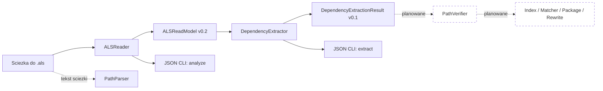
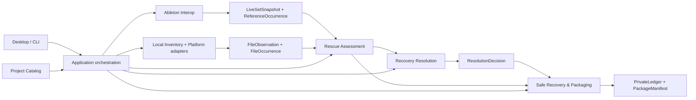
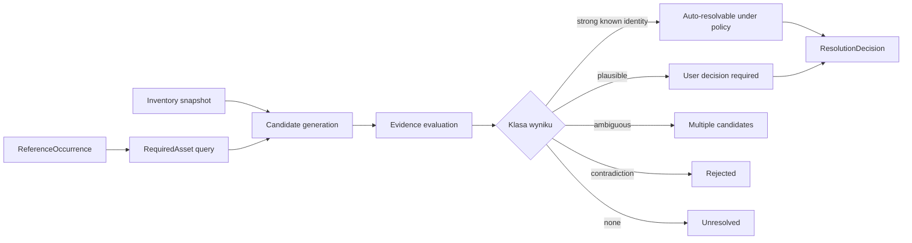
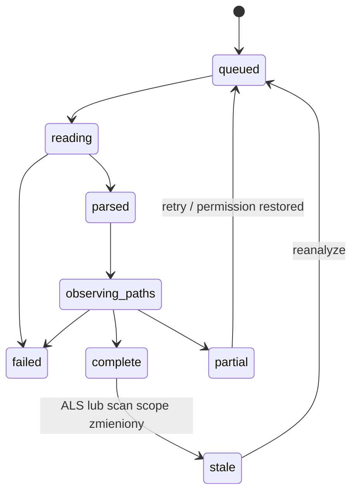
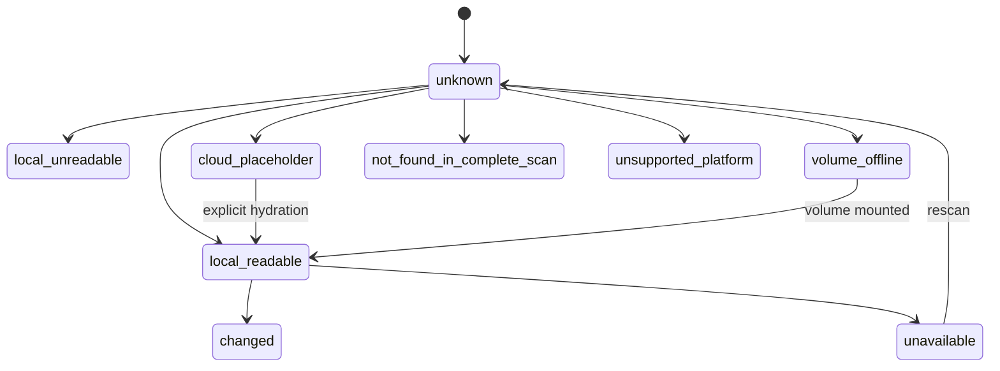
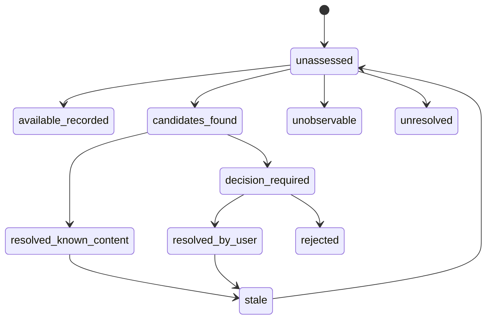
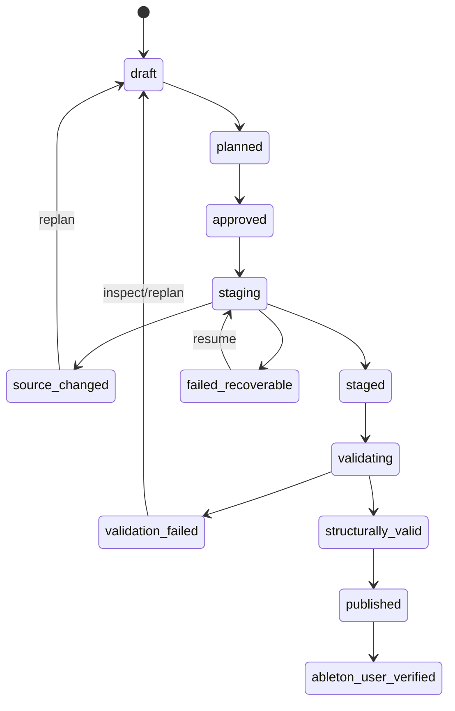
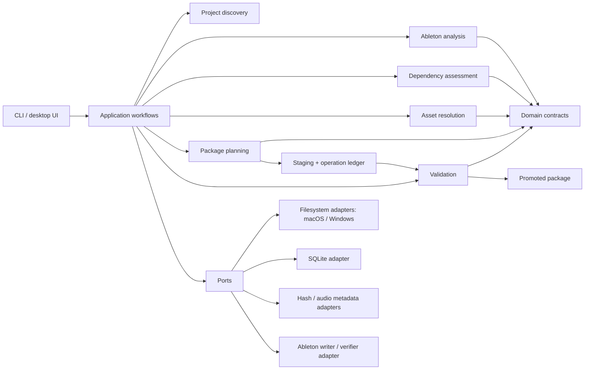
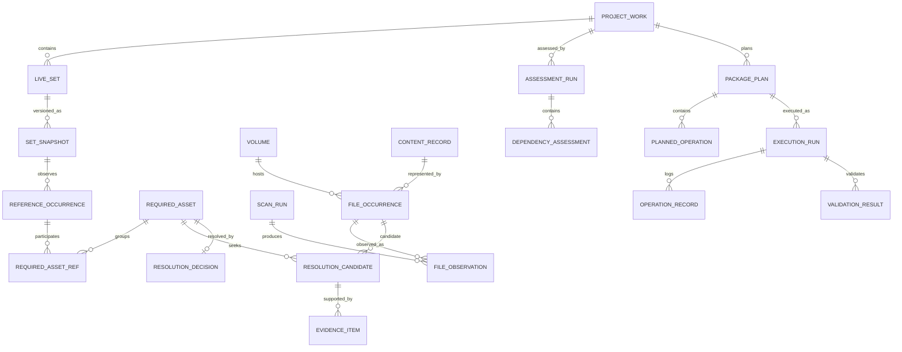

# Niezalezny audyt produktu, modelu domenowego i architektury

Data audytu: 2026-07-26  
Projekt: Ableton Project Rescue  
Zakres: produkt, domena, architektura, dane, wykonalnosc, bezpieczenstwo i roadmapa  
Charakter: analiza bez zmian kodu produkcyjnego

## 1. Executive Summary

### Werdykt w jednym zdaniu

Obecny fundament jest dobrym, konserwatywnym prototypem odczytu `.als`, ale nie jest jeszcze fundamentem bezpiecznego recovery: przed implementacja `PathVerifier`, indeksu, kopiowania i rewrite trzeba skorygowac model tozsamosci, semantyke Project Folder, statusy dostepnosci oraz polityke dowodow.

### Czym produkt powinien byc

Produkt powinien byc lokalnym, dzialajacym offline systemem **oceny odtwarzalnosci projektow Ableton oraz bezpiecznego recovery opartego na dowodach**. Ma odpowiedziec na cztery pytania:

1. czego konkretny Live Set potrzebuje;
2. co z tych rzeczy jest obecnie dostepne i gdzie;
3. z jaka pewnoscia brakujacy zasob zostal odnaleziony;
4. jakie jawne, odwracalne operacje utworza zweryfikowana kopie.

Parser `.als`, skaner plikow, indeks, kopiowanie i UI sa zdolnosciami wspierajacymi. Przewaga produktu nie wynika z samego gzip/XML. Powstaje w modelu dowodow, niepewnosci, decyzji uzytkownika, bezpiecznych planow, walidacji i wyjasnialnego manifestu.

### Core domain

**Evidence-based dependency resolution and safe recovery**, po polsku: oparte na dowodach rozstrzyganie zaleznosci i bezpieczne odzyskiwanie projektu.

`Project Health` jest widokiem wyniku tej domeny. `Portable Package` jest jednym z jej rezultatow. Collaboration, synchronizacja, globalny sample manager i sprzatanie bibliotek to pozniejsze, odrebne problemy.

### Ocena obecnego modelu

Model ma dobre zasady bezpieczenstwa i dobrze rozdziela techniczne etapy pipeline. Nie rozdziela jednak jeszcze wystarczajaco:

- Live Setu od Ableton Project Folder i logicznego utworu;
- referencji w XML od logicznie wymaganego zasobu;
- tresci pliku od fizycznego wystapienia pliku;
- sciezki od tozsamosci;
- obserwacji systemu plikow od trwalej decyzji;
- niedostepnosci od usuniecia;
- pewnosci dopasowania od stanu procesu;
- kompletnego audio od pelnej odtwarzalnosci projektu.

To nie wymaga przepisywania wszystkiego. Wymaga korekty kontraktow przed utrwaleniem kolejnych modulow.

### Ocena obecnej architektury

Rustowy modularny monolit z biblioteka `rescue_core` i cienkim CLI jest dobrym wyborem na ten etap. Nie ma uzasadnienia dla mikroserwisow, event sourcingu, grafowej bazy danych, osobnego daemona ani Tauri przed dowiezieniem read-only vertical slice.

Rzeczywista implementacja jest znacznie mniejsza od dokumentowanej architektury:

- dziala `ALSReader`;
- dziala `DependencyExtractor`;
- dziala tekstowy `PathParser`;
- `PathVerifier` istnieje tylko jako specyfikacja i kontrakt;
- nie ma discovery, SQLite, indeksu, matchera, pakowania, rewrite, walidatora, manifestu ani UI.

39 testow przechodzi, podobnie `cargo fmt`, `cargo check`, `cargo clippy` i aktualne guardy. Jednoczesnie audyt znalazl blad `xml_context`, bledna nazwe `source_project_root`, pozorny parametr `--json` oraz luki, ktorych guardy nie wykrywaja. Zielony build jest dowodem spelnienia obecnych testow, nie dowodem kompletnej poprawnosci domenowej.

### Najwieksza mocna strona

Najmocniejsza cecha projektu to konsekwentna zasada: **oryginaly sa tylko do odczytu, zapis wymaga planu, stagingu, walidacji i manifestu**. Jest ona obecna w dokumentacji i aktualnym kodzie read-only.

### Najwiekszy problem

Najwiekszym problemem nie jest brak funkcji, lecz ryzyko zakodowania zbyt mocnych twierdzen z za slabych dowodow. Obecna specyfikacja dopuszcza m.in. `source_project_root = parent(.als)`, status `verified_exact_path` na podstawie istnienia i rozmiaru oraz automatyczny wybor kandydata z wynikiem `>=95` bez znanego hasha oryginalu. Kazde z tych zalozen moze prowadzic do cichego wyboru niewlasciwego zasobu.

### Piec najwazniejszych zmian

1. Rozdzielic `AssetReference`, `RequiredAsset`, `FileOccurrence`, `AssetContent`, `Observation` i `ResolutionDecision`.
2. Przed kodem poprawic kontrakt `PathVerifier`: nie wybierac pliku, tylko rejestrowac kandydatow i obserwacje; oddzielic dostepnosc, rozmiar i pewnosc tozsamosci.
3. Usunac domniemanie, ze parent `.als` jest Project Folder; wymagac jawnego `AnalysisContext` albo potwierdzonego discovery.
4. Wycofac automatyczny recovery na podstawie scoringu metadanych; automatyczne powiazanie dopuszczac tylko przy mocnym, historycznie znanym dowodzie albo zatwierdzonej decyzji uzytkownika.
5. Przed dalszym rozwojem uporzadkowac granice repozytorium i prywatnych fixture'ow: projekt jest w calosci nieversionowany, bez `.gitignore`, razem z prywatnymi ALS/audio i artefaktami o rozmiarze 1,7 GiB.

### Piec rzeczy, ktorych teraz nie zmieniac

1. Rust jako jezyk rdzenia.
2. Jedna biblioteka core i cienkie CLI.
3. Read-only charakter `ALSReader`.
4. Zachowanie surowych wartosci ALS i rozdzielenie `OriginalFileRef` od obserwowanych `SampleRef/FileRef`.
5. Fixture tests, limity dekompresji oraz zasade plan -> staging -> validate -> manifest.

### Najwieksze ryzyka

- false positive wybierze niewlasciwy sample, ale projekt nadal sie otworzy;
- zlosliwy lub bledny ALS skieruje przyszle kopiowanie do prywatnego pliku przez `../` lub symlink;
- parser pominie zaleznosc w nieznanym kontekscie;
- poprawny XML po rewrite nie bedzie semantycznie poprawnym Setem;
- nieaktualny lub niekompletny skan zostanie zinterpretowany jako usuniecie;
- manifest ujawni pelne sciezki, nazwy projektow i pluginy odbiorcy paczki;
- licencjonowane sample albo Packs zostana przekazane bez podstawy licencyjnej;
- rozbudowana dokumentacja bedzie dawala sprzeczne instrukcje agentowi i czlowiekowi.

### Decyzja dotyczaca dalszej implementacji

Mozna kontynuowac prace, ale nie nalezy implementowac obecnego kontraktu `003-path-verifier` bez korekty. Po malej rewizji modelu wejscia/wyjscia nastepnym krokiem powinien byc read-only vertical slice: jeden wskazany Live Set + jawny Project Folder -> obserwowane referencje audio -> bezpieczne obserwacje sciezek -> wyjasnialny raport. CopyStager i ALSRewriter pozostaja zablokowane do czasu eksperymentow.

## 2. Metodyka i zakres

### Kolejnosc

1. Przeczytano brief audytowy oraz obowiazkowe `AGENTS.md`.
2. Przed ponownym otwarciem kodu utworzono clean-sheet baseline w `/tmp/ableton-clean-sheet-baseline.md`.
3. Obliczono SHA-256 baseline i nie edytowano go pozniej.
4. Zmapowano repozytorium, kod, testy, specyfikacje, ADR-y, eksperymenty i artefakty procesu.
5. Uruchomiono piec niezaleznych sciezek analizy: produkt/domena, Ableton/ALS, filesystem/index, repo, red team.
6. Przeprowadzono research oficjalnych zrodel Ableton, Apple i Microsoft oraz inspekcje publicznych repozytoriow bez instalowania i uruchamiania ich kodu.
7. Uruchomiono istniejace testy i guardy z `CARGO_TARGET_DIR` poza repozytorium.
8. Zderzono baseline, stan kodu, dokumenty, dowody z eksperymentow i zrodla zewnetrzne.
9. Przeprowadzono red team i drugi przeglad rekomendacji.

### Ograniczenia

- Autor audytu znal wczesniejsze rozmowy o projekcie. Baseline nie jest laboratoryjnie slepy; ograniczenie jest zapisane w jego tresci.
- Ableton nie publikuje pelnej, stabilnej specyfikacji odczytu i modyfikacji `.als`.
- Jedno lokalne pozytywne doswiadczenie z rewrite Live 11.3 nie tworzy macierzy kompatybilnosci.
- Nie uruchamiano obcego kodu ani nie instalowano znalezionych bibliotek.
- Nie uruchamiano Ableton Live w ramach audytu.
- Nie analizowano tresci muzycznej prywatnych projektow. Wykorzystano istniejace zagregowane raporty i testowe fixture'y.
- Nie udziela sie porady prawnej. Wskazane kwestie licencyjne wymagaja analizy regulaminow i, przed sprzedaza, konsultacji prawnej.

### Wykorzystane narzedzia i dowody

- `rg`, `find`, `wc`, `du`, `git`, `shasum`, `jq`;
- `cargo fmt --check`;
- `cargo check --workspace --locked`;
- `cargo test --workspace --locked`;
- `cargo clippy --workspace --all-targets --locked -- -D warnings`;
- `tools/workflow_guard.py` dla 001, 002 i 003;
- lokalny CLI na fixture do sprawdzenia `xml_context` i `--json`;
- oficjalna dokumentacja Ableton, Apple, Microsoft;
- API i pliki README/LICENSE publicznych repozytoriow GitHub.

### Wynik testow

Stan na 2026-07-26:

- `cargo fmt --check`: PASS;
- `cargo check --workspace --locked`: PASS;
- `cargo test --workspace --locked`: PASS, 39 testow;
- `cargo clippy ... -D warnings`: PASS;
- `verify-module 001-als-reader`: PASS;
- `verify-module 002-dependency-extractor`: PASS;
- `module-ready 003-path-verifier`: PASS.

Osobna proba na aktualnym CLI wykazala 22 konteksty zakonczone zduplikowanym tagiem, np. `.../FileRef/FileRef`. Po usunieciu znacznikow czasu wynik `analyze` z `--json` i bez tej flagi byl identyczny. To potwierdza, ze guardy nie pokrywaja wszystkich istotnych zachowan.

### Klasy pewnosci

- **POTWIERDZONE**: bezposredni dowod w kodzie, tescie, eksperymencie lub oficjalnym zrodle.
- **SILNIE UZASADNIONE**: kilka zgodnych dowodow, ale brak oficjalnej gwarancji.
- **WNIOSEK**: rekomendacja wynikajaca z dowodow.
- **HIPOTEZA**: prawdopodobne wyjasnienie bez wystarczajacego potwierdzenia.
- **NIEZNANE**: brak wiarygodnej odpowiedzi.
- **SPRZECZNE ZRODLA**: wiarygodne zrodla daja inne wyniki.
- **WYMAGA EKSPERYMENTU**: decyzja zalezy od kontrolowanego testu.

Wszystkie zrodla internetowe przywolane w raporcie sprawdzono 2026-07-26.

## 3. Clean-sheet baseline

Plik: `/tmp/ableton-clean-sheet-baseline.md`  
SHA-256: `4a8b3cb83408b74040aaba702e8bf915617421e18b1d66a7b5a8e7a8fe7400b4`

Ponizej znajduje sie niezmieniona tresc baseline:

```markdown
# Clean-sheet baseline: lokalny system integralnosci projektow Ableton Live

Data: 2026-07-26

## Ograniczenie niezaleznosci

Baseline powstal przed ponownym otwarciem kodu i dokumentacji projektu w tej sesji, na podstawie briefu audytowego oraz obowiazkowego `AGENTS.md`. Autor audytu uczestniczyl jednak we wczesniejszych rozmowach o projekcie i zna czesc jego historii. Nie jest wiec mozliwe uczciwe uznanie tego dokumentu za calkowicie slepy, niezalezny eksperyment. Jest to model "clean-sheet z kontrolowanym zakotwiczeniem", a nie laboratoryjnie niezalezna opinia.

## Problem uzytkownika

Plik projektu DAW nie jest samodzielnym utworem. Jest instrukcja odtworzenia sesji, ktora wskazuje na rozproszone pliki audio, urzadzenia, presety, biblioteki, wtyczki, wersje oprogramowania i zasoby dostepne tylko w okreslonym srodowisku. Z czasem sciezki i urzadzenia zmieniaja sie, dyski sa odlaczane, pliki sa przenoszone, a uzytkownik traci wiedze o tym, co jest potrzebne do otwarcia projektu.

Problemem nie jest samo "edytowanie ALS". Problemem jest brak wiarygodnej, wyjasnialnej wiedzy o odtwarzalnosci projektu oraz bezpiecznego procesu odzyskania lub przygotowania jego przenosnej kopii.

## Grupy uzytkownikow

- indywidualny producent z wieloletnim archiwum projektow;
- producent migrujacy na nowy komputer, system albo dysk;
- wspolproducent przygotowujacy handoff projektu;
- studio lub zespol posiadajacy wiele projektow i wspolna biblioteke;
- osoba porzadkujaca sample, ktora chce wiedziec, czy plik jest nadal uzywany;
- archiwista lub administrator techniczny przygotowujacy dlugoterminowe archiwum.

## Jobs To Be Done

1. Gdy wracam do starego projektu, chce wiedziec, czego brakuje i co moge odzyskac, abym nie otwieral go metoda prob i bledow.
2. Gdy przenosze projekt, chce utworzyc nowa, zweryfikowana kopie, abym nie uszkodzil oryginalu.
3. Gdy porzadkuje dysk, chce wiedziec, ktore projekty zaleza od danego pliku, abym nie usunal potrzebnego zasobu.
4. Gdy przekazuje projekt innej osobie, chce wiedziec, co zostalo dolaczone, czego nie mozna dolaczyc i jakie wymagania pozostaja.
5. Gdy aplikacja proponuje brakujacy sample, chce zobaczyc dowody dopasowania i moc odrzucic niepewna propozycje.

## Najwazniejsze przypadki uzycia

- odkrycie zestawow `.als` i przyporzadkowanie ich do fizycznych folderow projektow;
- analiza pojedynczego Live Set bez modyfikowania plikow;
- utworzenie migawki zaleznosci i srodowiska wymaganych przez Set;
- sprawdzenie dostepnosci wskazanych zasobow na aktualnym urzadzeniu;
- odnalezienie kandydatow dla brakujacych zasobow;
- zatwierdzenie lub odrzucenie niejednoznacznego dopasowania;
- zaplanowanie recovery lub przygotowania paczki;
- wykonanie planu w katalogu staging;
- weryfikacja rezultatu i zapis manifestu;
- globalne zapytanie: "ktore Sety odwoluja sie do tego zasobu?";
- ponowny skan i oznaczenie obserwacji, ktore mogly sie zdezaktualizowac.

## Proponowany jezyk domenowy

- **Work**: logiczny utwor lub przedsiewziecie muzyczne niezalezne od konkretnego pliku.
- **Live Set**: pojedynczy dokument `.als` reprezentujacy zapisana sesje Ableton Live.
- **Set Snapshot**: wynik analizy konkretnej wersji bajtowej `.als` w okreslonym czasie.
- **Project Folder**: fizyczny folder Ableton Live Project; moze zawierac wiele Live Setow i wspolne media.
- **Project Instance**: konkretne wystapienie folderu projektu na urzadzeniu lub wolumenie.
- **Asset Reference**: zapisane w Set odwolanie do oczekiwanego zasobu.
- **Asset Content**: logiczna tresc pliku, identyfikowana mocnym hashem, gdy tresc jest dostepna.
- **File Occurrence**: konkretne wystapienie pliku w lokalizacji, na wolumenie i w czasie obserwacji.
- **Observation**: fakt zebrany podczas konkretnego skanu; moze sie zdezaktualizowac.
- **Resolution Candidate**: wystapienie pliku, ktore moze spelniac dana referencje wraz z dowodami za i przeciw.
- **Resolution Decision**: jawna decyzja automatyczna lub uzytkownika o powiazaniu referencji z wystapieniem pliku.
- **Recovery Plan**: niezmienny plan operacji potrzebnych do stworzenia odzyskanej kopii.
- **Portable Package**: wynik procesu pakowania wraz z manifestem i statusem weryfikacji.
- **Reproducibility Assessment**: wielowymiarowa ocena mozliwosci odtworzenia Setu; nie pojedynczy arbitralny procent.
- **Manifest**: przenosny zapis zawartosci, pochodzenia, decyzji, sum kontrolnych, brakow i wersji regul.

## Potencjalne subdomeny

### Core domain

**Evidence-based dependency resolution and safe recovery**: przeksztalcenie niepelnych referencji projektu oraz obserwacji systemu plikow w wyjasnialne, bezpieczne decyzje odzyskania. Parser jest potrzebny, ale sam w sobie nie jest przewaga produktu. Przewaga powstaje w modelu dowodow, niepewnosci, decyzji, bezpiecznych planow i walidacji.

### Supporting subdomains

- interpretacja dokumentow Ableton i normalizacja referencji;
- discovery Live Setow i Project Folderow;
- inwentaryzacja lokalnych plikow i wolumenow;
- ocena zdrowia i odtwarzalnosci;
- budowa oraz walidacja paczki;
- rejestr wymagan dotyczacych wtyczek i bibliotek;
- obsluga decyzji uzytkownika.

### Generic subdomains

- lokalna baza i migracje;
- kolejka zadan, checkpointy i anulowanie;
- logowanie, telemetria lokalna i diagnostyka;
- adaptery macOS/Windows;
- kryptograficzne sumy kontrolne;
- UI i aktualizacje aplikacji.

## Potencjalne bounded contexts

1. **Ableton Interpretation**: czyta dokumenty Ableton i emituje znormalizowane fakty wraz z pochodzeniem; nie dotyka dysku poza odczytem dokumentu i nie rozstrzyga dopasowan.
2. **Local Inventory**: obserwuje urzadzenia, wolumeny i wystapienia plikow; nie interpretuje semantyki ALS.
3. **Dependency Resolution**: porownuje referencje z wystapieniami plikow, tworzy dowody i kandydatow; jest wlascicielem niepewnosci dopasowania.
4. **Project Assessment**: agreguje wyniki dla Setu/Project Folder i tworzy wyjasnialna ocene kompletnosci, przenosnosci i ryzyka.
5. **Recovery and Packaging**: tworzy plan, staging, kopiuje, opcjonalnie relinkuje kopie dokumentu, weryfikuje i publikuje paczke.
6. **Catalog and Decisions**: przechowuje logiczne projekty, migawki, obserwacje, decyzje uzytkownika i historie analiz.
7. **Platform Integration**: udostepnia kontrolowany dostep do systemu plikow, wolumenow, chmury, uprawnien i watcherow.

Na etapie MVP contexts moga byc modulami jednego procesu i jednego executable. Nie wymagaja mikroserwisow ani event busa.

## Najwazniejsze obiekty domenowe

- `LiveSetSnapshot` jako niezmienny wynik analizy konkretnego pliku;
- `AssetReference` jako oczekiwanie zapisane w dokumencie;
- `FileObservation` jako zalezne od czasu i urzadzenia spostrzezenie;
- `AssetIdentityEvidence` jako zestaw niezaleznych sygnalow;
- `ResolutionCandidate` i `ResolutionDecision` jako model niepewnosci i decyzji;
- `RecoveryJob` jako dlugotrwaly proces z checkpointami;
- `RecoveryPlan` jako jawny, zatwierdzany kontrakt przed zapisem;
- `PackageManifest` i `VerificationResult` jako dowody rezultatu.

Nie nalezy automatycznie tworzyc encji domenowej dla kazdego wezla XML, kazdej sciezki ani kazdej tabeli bazy.

## Najwazniejsze inwarianty

1. Oryginalny `.als` i oryginalne zasoby sa tylko do odczytu.
2. Zadna nieodwracalna lub zapisujaca operacja nie zachodzi bez jawnego planu i wybranego katalogu docelowego.
3. Niejednoznaczny kandydat nie moze byc automatycznie uznany za poprawny.
4. Sciezka, nazwa i `OriginalCrc` nie sa same w sobie stabilna tozsamoscia tresci.
5. Obserwacja systemu plikow zawsze ma czas, urzadzenie/wolumen i status swiezosci.
6. Niedostepny plik nie jest automatycznie plikiem usunietym.
7. Przerwany job nie publikuje paczki jako kompletnej.
8. Ponowienie tego samego planu jest idempotentne albo jawnie wykrywa konflikt.
9. Wynik zostaje opublikowany dopiero po weryfikacji; brak mozliwosci uruchomienia Abletona ogranicza sile deklaracji.
10. Kazda decyzja automatyczna i uzytkownika ma zapisane dowody, wersje regul i pochodzenie.
11. Deklaracja przenosnosci oddziela media, wymagania Ableton, pluginy, licencje oraz inne nierozwiazane zaleznosci.
12. Aplikacja nie obiecuje ochrony przed kazdym usunieciem wykonanym poza nia; ocenia wplyw na podstawie swiezosci indeksu.

## Mozliwe architektury

### Wariant minimalny

Jedna biblioteka domenowa i CLI. Funkcje sa czystym pipeline: odczyt -> normalizacja -> sprawdzenie sciezek -> raport. Brak trwalej bazy, watcherow i zapisu ALS. Dobry do falsyfikacji parsera i modelu referencji.

### Wariant rekomendowany

Modularny monolit local-first: czysty rdzen domenowy, porty dla systemu plikow/hashy/metadanych, lokalna relacyjna baza jako odtwarzalny indeks i rejestr decyzji, prosty system jobow dla skanow i recovery, osobny adapter UI. Zapis odbywa sie w staging i jest publikowany po walidacji.

### Wariant przyszly

Desktop UI plus lokalny background service, gdy niezawodne dlugie skany i watchery naprawde tego wymagaja. Synchronizacja/chmura pozostaje adapterem do istniejacych dostawcow. Nie ma uzasadnienia dla mikroserwisow ani grafowej bazy na starcie; relacje wiele-do-wielu wystarcza w SQL, dopoki zapytania i skala nie udowodnia inaczej.

## Najwieksze niewiadome

- pelny i wersjowo stabilny zakres aktywnych referencji w `.als`;
- czy bezposredni rewrite kopii `.als` jest niezawodny dla wspieranych wersji i typow referencji;
- jakie dane Ableton wykorzystuje przy automatycznym odnajdywaniu mediow;
- semantyka `OriginalCrc` i jego przydatnosc jako slaby sygnal;
- reprezentacja urzadzen, pluginow, presetow, take lanes, freeze, video i Max for Live;
- zachowanie Collect All and Save przy kolizjach nazw i zasobach licencjonowanych;
- mozliwosc wiarygodnej walidacji bez uruchomienia Ableton Live;
- wymagany poziom uprawnien i zachowanie cloud placeholders na macOS/Windows;
- realistyczny koszt pelnego skanu i fingerprintingu duzej biblioteki;
- granica legalnego pakowania komercyjnych bibliotek i Factory Packs.

## Najwieksze ryzyka

- false positive dopasowuje niewlasciwy audio asset i projekt otwiera sie bez widocznego bledu;
- parser pomija aktywna referencje w nieznanej strukturze;
- rewrite tworzy syntaktycznie poprawny, lecz semantycznie zmieniony Set;
- nieaktualny indeks prowadzi do falszywego zapewnienia, ze plik jest nieuzywany;
- symlink, race condition lub kolizja nazwy kieruje zapis poza staging albo nadpisuje wynik;
- produkt obiecuje pelna przenosnosc mimo brakujacych pluginow lub ograniczen licencyjnych;
- zakres rescue, biezacego zarzadzania i collaboration rozprasza rozwoj przed potwierdzeniem core domain.

## Minimalny zakres produktu

MVP powinno dowiesc jednego pionowego scenariusza dla jednego wybranego Live Setu:

1. bezpiecznie odczytac kopie lub read-only oryginal dokumentu;
2. wydobyc wspierane aktywne referencje audio i jawnie pokazac zakres niewspierany;
3. sprawdzic wskazane sciezki na biezacym urzadzeniu;
4. zbudowac raport: odnalezione, niedostepne, niezweryfikowane i ryzykowne;
5. dla brakujacych pozycji przeszukac jawnie wybrany zakres i pokazac kandydatow z dowodami;
6. zapisac decyzje uzytkownika i manifest analizy;
7. opcjonalnie, dopiero po eksperymencie rewrite, utworzyc w staging zweryfikowana kopie jednego projektu.

MVP nie powinno obiecywac ochrony przed usunieciem w Finderze/Explorerze, pelnej obslugi pluginow, collaboration, automatycznej synchronizacji chmurowej ani wszystkich wersji Live.

## Elementy pozniejsze

- discovery i batch analysis wielu Project Folderow;
- przyrostowy globalny indeks i impact analysis przed porzadkowaniem;
- background jobs i watchery;
- pelny plugin/preset/environment inventory;
- rygorystyczne portable packages i handoff;
- integracje cloud storage;
- konflikty i wersjonowanie wspolpracy;
- migracja miedzy macOS i Windows;
- fingerprint audio dla zmienionych nagran jako sugestia, nigdy dowod identycznosci;
- integracja z Ableton lub Max for Live, jesli eksperymenty wykaza realna wartosc.
```

### Porownanie baseline ze stanem repo

Baseline i niezalezne sciezki analizy sa zgodne w czterech punktach:

- parser nie jest core domain;
- `Project`, referencja, tresc i wystapienie pliku musza byc odrebne;
- bezpieczny produkt opiera sie na faktach, obserwacjach, decyzjach i planach;
- MVP powinno byc mniejsze od obecnej listy `In MVP` w `PRODUCT_SPEC.md`.

Rozbieznosc dotyczy szerokosci pierwszego MVP. Baseline dopuszczal wyszukiwanie kandydatow. Po audycie repo rekomendacja zostala jeszcze zwezona: pierwszym releasable pionem powinien byc raport read-only, a wyszukiwanie brakow wejsc dopiero po ustaleniu stabilnych identyfikatorow referencji i obserwacji.

## 4. Problem produktowy i Jobs To Be Done

### Problem, nie rozwiazanie

Uzytkownik posiada dokumenty `.als`, ale nie posiada wiarygodnej mapy warunkow potrzebnych do ich odtworzenia. Zasoby sa rozproszone, sciezki i wolumeny zmieniaja sie, pluginy maja wersje i formaty, a Ableton Project Folder moze zawierac wiele Setow dzielacych media.

Problem nie brzmi: "jak zmienic XML". Brzmi: "jak udowodnic, co projekt potrzebuje, odzyskac to bez zgadywania i utworzyc kopie bez naruszenia oryginalu".

### Priorytetowe JTBD

| Priorytet | Job | Kryterium wartosci |
| --- | --- | --- |
| 1 | Gdy otwieram stary Set, chce zobaczyc brakujace i ryzykowne zaleznosci. | Raport jest kompletny w granicach zadeklarowanego support matrix i wyjasnia niewiadome. |
| 2 | Gdy sample zniknal ze starej sciezki, chce zobaczyc kandydatow i dowody. | System nie wybiera cicho pliku o podobnej nazwie. |
| 3 | Gdy przenosze projekt, chce przygotowac zweryfikowana kopie. | Oryginal jest nienaruszony, wynik ma manifest i status weryfikacji. |
| 4 | Gdy porzadkuje biblioteke, chce znac wplyw usuniecia pliku. | Wynik ujawnia swiezosc i kompletnosc indeksu; nie obiecuje ochrony przed kazda operacja systemowa. |
| 5 | Gdy wysylam projekt, chce wiedziec, czego paczka nie zawiera. | Media, pluginy, Packs, licencje i wersje sa oceniane osobno. |

### Funkcje sluzace problemowi

- odczyt i normalizacja wspieranych referencji ALS;
- obserwacja sciezek i wolumenow;
- indeks wystapien plikow i tresci;
- ranking kandydatow;
- utrwalanie decyzji;
- project assessment;
- plan, staging, copy, opcjonalny rewrite, walidacja i manifest.

### Pozniejsze rozszerzenia

- globalny katalog projektow;
- ciagly monitoring zmian;
- impact analysis przed sprzataniem;
- batch recovery;
- plugin/preset intelligence;
- integracje cloud;
- handoff i collaboration.

Nie powinny one definiowac pierwszej implementacji core.

## 5. Co wlasciwie jest produktem

### Rekomendowane pozycjonowanie

**Ableton Project Rescue to local-first preflight i recovery engine dla Live Setow: pokazuje, co projekt potrzebuje, z jakich dowodow wynika stan zaleznosci, a nastepnie przygotowuje bezpieczny plan odzyskania lub przeniesienia kopii.**

Produkt sklada sie z trzech stopni wartosci:

1. **Dependency awareness**: fakty i obserwacje.
2. **Recovery resolution**: kandydaci, dowody i decyzje.
3. **Safe packaging**: plan, wykonanie, walidacja i manifest.

`Project Health` jest UX-em nad tymi trzema stopniami, a nie osobnym core. Collaboration jest osobnym problemem, poniewaz wymaga konfliktow, autorstwa, wersjonowania i synchronizacji, a nie tylko zaleznosci plikowych.

### Realistyczna obietnica

Produkt moze obiecac:

- lokalna, read-only analize wspieranych elementow;
- wskazanie aktualnie dostepnych i niedostepnych sciezek;
- wyjasnialne kandydatury dla brakow;
- bezpieczna kopie dla jawnie wspieranych przypadkow;
- raport ograniczen i wymagania srodowiska.

Nie moze jeszcze obiecac:

- wykrycia wszystkich zaleznosci kazdej wersji Live;
- stuprocentowego odzyskania sampla bez historycznego hasha;
- pelnej odtwarzalnosci bez uruchomienia Abletona i pluginow;
- ostrzezenia przed kazdym usunieciem w Finderze/Explorerze;
- legalnosci wyslania kazdego skopiowanego sampla;
- bezpiecznego rewrite dowolnego `.als`.

### Wzorce z innych branz

- [InDesign Package i Preflight](https://helpx.adobe.com/indesign/desktop/print/preflight/package-files-for-output.html) rozdziela sprawdzenie problemow, kopiowanie zaleznosci, relink i raport. To najblizszy wzorzec UX.
- [Unreal Asset Redirectors](https://dev.epicgames.com/documentation/unreal-engine/asset-redirectors-in-unreal-engine) pokazuja, ze przeniesienie, tymczasowe przekierowanie i finalne `Fixup` sa osobnymi etapami, a czesciowe przepiecie jest niebezpieczne.
- Ableton `Collect All and Save` jest oracle zachowania, ale nie wystarcza jako model produktu: nie kopiuje pluginow, a oficjalna dokumentacja odroznia zrodla i missing media.

Wspolny wzorzec brzmi: **preflight -> jawny plan -> package/relink -> validation -> report**, a nie "znajdz sciezke i zamien tekst".

## 6. Obecny stan repozytorium

### Granica wersjonowania

**POTWIERDZONE, P0:** katalog `als-rewrite-lab` nie jest sledzonym repozytorium. Git root znajduje sie w `Documents/New project`, a `git ls-files als-rewrite-lab` zwraca 0. Calosc jest nieversionowana. Brakuje `.gitignore`.

Rozmiar katalogu wynosi ok. 1,7 GiB, w tym:

- `experiments/`: ok. 1,2 GiB;
- `target/`: ok. 377 MiB;
- `Archiwum.zip`: ok. 155 MiB;
- 90 plikow `.als`;
- 205 plikow audio;
- 184 pliki `.asd`.

To jest ryzyko utraty historii kodu i przypadkowego opublikowania prywatnych lub licencjonowanych danych. Nie zmieniono tego w audycie, poniewaz dozwolony byl tylko raport.

### Stos technologiczny

| Obszar | Stan rzeczywisty | Dowod |
| --- | --- | --- |
| Jezyk core | Rust | `Cargo.toml`, `crates/rescue_core` |
| Aplikacja | CLI, brak desktop UI | `cli/rescue-cli/src/main.rs` |
| Workspace | `rescue_core`, `rescue-cli` | glowny `Cargo.toml:1-5` |
| Gzip | `flate2` | `crates/rescue_core/Cargo.toml` |
| XML | read-only `roxmltree` | `crates/rescue_core/Cargo.toml` |
| Hash | SHA-256 przez `sha2` | `als_reader_impl.rs:24,334-336` |
| Serializacja | `serde`, `serde_json` | Cargo files i CLI |
| Baza | brak | brak zaleznosci i kodu storage |
| Siec/chmura | brak | brak zaleznosci i adapterow |
| Zapis ALS | brak | brak writer/rewriter w kodzie |
| UI | brak | brak frameworka frontendowego |

### Rzeczywisty przeplyw



### ALSReader

`analyze_als_impl`:

1. sprawdza istnienie sciezki;
2. czyta metadata i limit skompresowanego wejscia;
3. czyta caly plik;
4. liczy SHA-256 skompresowanych bajtow;
5. dekompresuje gzip do limitu 1 GiB;
6. wymaga UTF-8 i poprawnego XML;
7. wymaga root elementu `Ableton`;
8. zbiera bezposrednie `SampleRef/FileRef`;
9. osobno zbiera `OriginalFileRef` i pozostale `FileRef`;
10. zwraca model, nie zapisujac na dysku.

Dowody: `crates/rescue_core/src/als_reader_impl.rs:14-92`, `95-265`, `339-422`.

Mocne strony:

- read-only;
- strukturalne bledy;
- limity dekompresji;
- surowe sciezki zachowane jako string;
- pola rewrite maja stan `requires_test`;
- `OriginalFileRef` nie jest mieszany z obserwowanym `SampleRef/FileRef`.

Problemy:

- `source_project_root` to tylko `path.parent()` (`:63-65`), a nie wykryty Project Folder;
- `xml_context_for` dodaje biezacy tag drugi raz (`:301-309`); proba CLI wykazala `.../FileRef/FileRef`;
- `usage_context` jest zawsze `unknown` (`:185`);
- kazdy direct `SampleRef/FileRef` nazywany jest "active", choc to obserwowana regula strukturalna, nie pelna semantyka Live;
- `GzDecoder` wymaga osobnej polityki dla wielu gzip members i trailing bytes;
- maksymalne limity 512 MiB/1 GiB nadal dopuszczaja bardzo wysokie zuzycie pamieci;
- brakuje limitu liczby wezlow/referencji, glebokosci i dlugosci pol;
- `to_string_lossy` moze utracic nietypowe nazwy sciezek hosta.

### DependencyExtractor

`extract_dependencies_impl`:

- akceptuje `ALSReadModel v0.2`;
- odrzuca model z fatalnymi bledami;
- tworzy 1 `DependencyRef` na 1 obserwowana referencje;
- nie deduplikuje;
- zachowuje surowe pola;
- ignoruje historyczne i non-audio elementy z podsumowaniem;
- nie sprawdza filesystemu, nie matchuje i nie zapisuje.

Dowody: `dependency_extractor_impl.rs:10-96`, testy w `crates/rescue_core/tests/dependency_extractor.rs`.

Problem domenowy: `DependencyRef` nadal reprezentuje wystapienie referencji, nie unikalny wymagany plik. Eksperyment CAS mial 33 zmienione referencje, ale tylko 6 fizycznych plikow audio. Nazwa `DependencyRef` jest do utrzymania jedynie wtedy, gdy jawnie oznacza `ReferenceOccurrence`; grupowanie w `RequiredAsset` musi byc osobnym krokiem.

Problem tozsamosci: `dependency_id = dep_audio_{position}` (`dependency_extractor_impl.rs:52`). ID jest deterministyczne dla niezmienionego snapshotu, ale wstawienie wczesniejszej referencji przesuwa wszystkie kolejne ID. Nie nadaje sie do trwalych decyzji, manifestow i porownan miedzy snapshotami bez dodatkowego scope.

### PathParser

`parse_als_path` klasyfikuje tekst jako macOS absolute/volume, Windows drive/UNC, relative, bare, empty lub unknown, zachowujac raw string. To dobra, platform-neutralna granica. `RawAlsPath` jest jednak publiczny i nieuzywany, a parser przyjmuje `&str`, co jest niewielka przedwczesna abstrakcja.

### CLI

CLI posiada `analyze` i `extract`. Parametr `--json` nie zmienia formatu; obie sciezki zawsze zwracaja pretty JSON. Dwie proby roznily sie tylko znacznikami czasu. To nie jest ryzyko danych, ale kontrakt CLI jest mylacy i nie ma testow integracyjnych CLI.

### Testy i guardy

Testy pokrywaja prawidlowy ALS, uszkodzony gzip/XML/root, limity, `RelativePathType 0`, sciezki Windows/UNC, read-only, brak deduplikacji, deterministycznosc i zakazane pola downstream. To solidna baza dla obecnego zakresu.

`workflow_guard.py` jest przydatnym linterem polityki, lecz nie proof systemem:

- parsuje Rust regexami;
- uznaje za bezwartosciowe tylko cztery literalne tautologie;
- nie uruchamia `cargo test` ani kompilacji;
- limity linii sprawdza tylko na `expected_source_files`, przez co 422-liniowy `als_reader_impl.rs` i 287-liniowy `dependency_extractor_impl.rs` nie zablokowaly PASS;
- wymaga literalow i nazw testow, ale nie dowodzi semantyki.

Guard nalezy zachowac, nazwac policy lintem i wlaczyc do jednej kanonicznej komendy razem z fmt/check/test/clippy.

### Dokumentacja i dryf

Dokumentacja zawiera dobre zasady, lecz jest za duza i sprzeczna z aktualnym stanem:

- 78 plikow Markdown;
- co najmniej 31 tys. slow w glownych dokumentach poza eksperymentami i digestami;
- `CURRENT_STATE.md` ma 1250 linii i jednoczesnie opisuje kilka historycznych "next steps";
- `AGENTS.md` ma dwa rozdzialy `Current Next Step`;
- `PRODUCT_SPEC.md` jest zadeklarowany jako source of truth, ale jego `DependencyRef` laczy surowe fakty z resolved path, existence i ryzykiem, wbrew faktycznej separacji modulow;
- build order umieszcza `ProjectDiscovery` przed `PathVerifier`, lecz kod przeszedl do 003 bez discovery i uzyl parenta `.als` jako root;
- `PROJECT_MAP.md` nazywa dokumenty i warstwy procesu `Core Domains`, mieszajac governance z DDD.

Rekomendacja nie brzmi "usunac dokumentacje". Brzmi: po ustaleniu modelu utrzymywac piec aktywnych klas dokumentow: product/domain brief, jednokartkowy current state, ADR-y, spec aktualnego modulu, backlog/research. Historyczne digests i eksperymenty powinny byc archiwum, nie aktywnym routingiem dla kazdej sesji.

## 7. Slownik domenowy

| Pojecie rekomendowane | Definicja i przyklad | Obecna nazwa / problem | Bounded context | Rekomendacja |
| --- | --- | --- | --- | --- |
| `Work` | Logiczny utwor lub przedsiewziecie, np. jedna piosenka niezalezna od liczby Setow. Nie jest folderem. | Brak; `Project` bywa uzywany jako utwor, folder i ALS. | Catalog | Dodac dopiero, gdy katalog ma laczyc wiele wariantow; nie jest potrzebny w pierwszym MVP. |
| `LiveSet` | Dokument `.als` jako rzecz posiadajaca historie wersji. | `Ableton Live Set`, czasem `Project`. | Ableton Interop / Catalog | Uzywac konsekwentnie dla jednego `.als`. |
| `LiveSetSnapshot` | Niezmienna analiza konkretnych bajtow ALS, identyfikowana hashem pliku i wersja parsera. | `ALSReadModel` miesza snapshot z raportem wykonania i timestampami. | Ableton Interop | Zachowac `ALSReadModel` jako DTO adaptera; domenowo nazwac wynik snapshotem. |
| `ProjectFolder` | Folder rozpoznany jako Ableton Live Project, mogacy zawierac wiele Setow, `Samples`, `Backup`, `Presets`, `Ableton Project Info`. | `source_project_root` jest obecnie parentem ALS. | Catalog / Assessment | Root musi byc jawny lub wykryty z dowodem, nie domniemany. |
| `ProjectInstance` | Konkretne wystapienie Project Folder na danym urzadzeniu i wolumenie. | `ProjectRecord` laczy logiczny projekt z fizyczna lokalizacja. | Catalog / Inventory | Rozdzielic dopiero przy trwalym indeksie i wielu komputerach. |
| `SetVariant` | Relacja miedzy Setami tego samego Work: wersja, remix, wariant. | `main_als_path` sugeruje jeden glowny Set. | Catalog | Nie wybierac automatycznie jednego main ALS bez polityki/uzytkownika. |
| `BackupSet` | Set w oficjalnym folderze/nazewnictwie backupu; nadal pelny dokument, nie tylko metadata. | `backup_als_paths`. | Catalog | Ukrywac domyslnie, ale zachowac jako powiazany Set. |
| `ReferenceOccurrence` | Jedno konkretne miejsce w snapshotcie ALS, ktore wskazuje zasob. 33 wystapienia moga wskazywac 6 plikow. | `ActiveAudioReference`, `DependencyRef`. | Ableton Interop | Nazwa ma komunikowac wystapienie; ID na razie snapshot-local. |
| `RequiredAsset` | Logiczne wymaganie Setu grupujace referencje oczekujace tej samej tresci lub tego samego zasobu. | Brak. | Assessment / Resolution | Dodac jako wynik jawnego grupowania; nie deduplikowac w Readerze. |
| `AssetContent` | Bajtowa tresc pliku; gdy dostepna, identyfikowana algorytmem i digestem. | `AssetRecord.hash_full` obok path. | Inventory | Oddzielic od lokalizacji. |
| `FileOccurrence` | Konkretne wystapienie pliku pod sciezka, na wolumenie, w czasie skanu. | `AssetRecord.path`. | Inventory | Osobna encja z obserwacjami i opcjonalnym `content_id`. |
| `PathClaim` | Surowa sciezka zapisana w ALS, bez twierdzenia, ze istnieje. | `raw_path`, `raw_relative_path`. | Ableton Interop | Zachowac bez normalizacji. |
| `PathCandidate` | Bezpiecznie wyliczona potencjalna lokalizacja do obserwacji. | `selected_path_candidate`. | Platform / Assessment | Nie wybierac przy generowaniu; zwrocic wszystkie wraz z pochodzeniem. |
| `FileObservation` | Wynik pojedynczej proby: present, permission denied, volume offline, placeholder itd., z czasem i scan ID. | `verification_status`, `existence_status`. | Inventory / Platform | Nie nadpisywac faktow ALS; obserwacje sa efemeryczne i moga byc stale. |
| `ResolutionCandidate` | FileOccurrence proponowany dla brakujacej referencji wraz z dowodami i kontrdowodami. | `MatchCandidate`. | Resolution | Ranking nie jest decyzja. |
| `ResolutionDecision` | Jawne zaakceptowanie/odrzucenie powiazania przez regule lub uzytkownika. | Pola `accepted_by_user`, `auto_selected`. | Resolution | Osobna encja z evidence snapshot i ruleset version. |
| `Availability` | Dostepnosc wystapienia tu i teraz, np. local-readable, placeholder, volume-offline. | Ogolne `missing`. | Inventory | Nie utozsamiac z historia usuniecia. |
| `CompletenessAssessment` | Czy zadeklarowany zakres zaleznosci zostal rozliczony. | `project_status`, `health`. | Assessment | Wielowymiarowy wynik, nie jeden procent. |
| `ReproducibilityAssessment` | Czy Set prawdopodobnie zabrzmi/otworzy sie poprawnie z mediami, Live, pluginami, Packs i licencjami. | `ready`, `damaged`. | Assessment | Osobne osie i jawne ograniczenia dowodowe. |
| `RecoveryPlan` | Niezmienny zestaw operacji i preconditions zatwierdzony przed zapisem. | `PackagePlan`. | Recovery & Packaging | Plan ma wskazywac snapshot ALS, generacje indeksu i hash zrodel. |
| `RecoveryJob` | Wznawialne wykonanie planu z checkpointami. | `BatchRunner`, rozproszone statusy. | Recovery & Packaging | Prosty lokalny job, nie event sourcing. |
| `PortablePackage` | Opublikowany folder wynikowy po walidacji. | `package`, `self-contained project`. | Recovery & Packaging | Nie nazywac kompletnym bez macierzy walidacji. |
| `PrivateLedger` | Lokalny pelny audyt zawierajacy sciezki i dane diagnostyczne. | `Manifest` ma zawierac wszystko. | Catalog / Audit | Oddzielic od eksportowanego manifestu. |
| `PackageManifest` | Zredagowany, przenosny opis zawartosci, hashy, brakow, zasad i weryfikacji. | `Manifest`. | Recovery & Packaging | Bez lokalnych sciezek i danych prywatnych domyslnie. |

Terminy interfejsu moga byc prostsze: "Set", "folder projektu", "znaleziony plik", "wymaga decyzji", "gotowa kopia". Model wewnetrzny nie powinien jednak tracic powyzszych rozroznien.

## 8. Subdomeny i bounded contexts

### Subdomeny

| Typ | Subdomena | Dlaczego |
| --- | --- | --- |
| Core | Rescue Assessment | Przeksztalca niepelne fakty w wyjasnialna ocene i blokery. |
| Core | Recovery Resolution | Buduje kandydatow i decyzje bez ukrywania niepewnosci. |
| Core | Safe Recovery & Packaging | Zamienia zatwierdzone decyzje w bezpieczny plan i zweryfikowany wynik. |
| Supporting | Ableton Interop | Reverse-engineered interpretacja ALS oraz przyszly waski writer. |
| Supporting | Project Catalog | Grupuje Sety, foldery, backupy, warianty i urzadzenia. |
| Supporting | Local Inventory | Obserwuje pliki, wolumeny, hashe i swiezosc skanow. |
| Supporting | Environment Requirements | Pluginy, Live, Packs, Max for Live, presety. |
| Generic | Platform filesystem | Bezpieczne I/O, permissions, cloud, watchers. |
| Generic | Jobs, storage, logging | SQLite, checkpointy, migracje, diagnostyka. |
| Generic | Desktop UI | Prezentacja i interakcja. |

Produkt nie powinien miec pieciu core domains naraz. `Dependency Intelligence`, `Project Health` i `Portable Packaging` sa kolejnymi widokami tego samego core: wyjasnialnego recovery.

### Mapa kontekstow



### Odpowiedzialnosci i kontrakty

| Context | Wlasciciel danych | Wejscie | Wyjscie | Nie nalezy tu |
| --- | --- | --- | --- | --- |
| Ableton Interop | surowe fakty i provenance z konkretnego ALS | bytes/path + `AnalysisContext` | `LiveSetSnapshot`, reference occurrences, unsupported signals | filesystem resolution, scoring, package policy |
| Project Catalog | Work/LiveSet/ProjectFolder/ProjectInstance relacje | discovery observations, decyzje uzytkownika | wybrany Set i potwierdzony context | parsowanie XML, hashing audio |
| Local Inventory | wolumeny, scan runs, file occurrences, content hashes | approved scan roots | observations i indeks | interpretacja ALS, wybor matcha |
| Rescue Assessment | wymagane aktywa, blokery, completeness/reproducibility | snapshot + observations + environment facts | `ProjectAssessment` | kopiowanie, SQL, UI |
| Recovery Resolution | candidates, evidence, decisions | unresolved requirement + index snapshot | ranked candidates i decyzje | write ALS, ukryty auto-pick |
| Recovery & Packaging | plans, jobs, package results | assessment + decisions + target | plan, verified package, manifest | odkrywanie nowych faktow w trakcie wykonania bez replan |
| Environment Requirements | wymagania plugin/Live/Pack | sygnaly ALS i inventory | requirement report | kopiowanie binariow pluginow |

Na obecnym etapie to **granice modulow jednego procesu**, nie osobne crate'y ani serwisy. Obecne `ALSReader`, `DependencyExtractor`, `PathParser` i planowany `PathVerifier` sa krokami technicznymi wewnatrz tych granic, nie samodzielnymi bounded contexts.

## 9. Docelowy model domenowy

### Elementy modelu

| Element | Rodzaj | Tozsamosc i cykl zycia | Inwarianty / dane | Wlasciciel |
| --- | --- | --- | --- | --- |
| `LiveSet` | entity | wewnetrzne ID; moze miec wiele snapshotow | nazwa i relacje katalogowe, nie bytes | Catalog |
| `LiveSetSnapshot` | immutable entity/value-like aggregate | `sha256(compressed ALS bytes)` + parser/rules version | fakty nigdy nie sa nadpisywane obserwacja FS | Ableton Interop |
| `ReferenceOccurrence` | entity w granicy snapshotu | snapshot ID + stabilny locator; do czasu eksperymentu tylko snapshot-local ID | raw path, XML context, provenance | Ableton Interop |
| `RequiredAsset` | entity/aggregate member | ID wyprowadzone z reguly grupowania i snapshotu | grupuje occurrences; brak content ID jest legalny | Assessment |
| `Volume` | entity | wewnetrzne UUID + platform evidence, nie sama nazwa mounta | platform, filesystem, case mode, online state | Inventory |
| `ScanRun` | aggregate | scan UUID + scope hash + generation | completeness, checkpoint, errors, started/completed | Inventory |
| `FileOccurrence` | entity | wewnetrzne UUID; OS file ID jest dowodem, nie jedynym ID | native path, volume, kind, symlink target, last seen | Inventory |
| `AssetContent` | value/entity | algorithm + full digest + size | jedna tresc, wiele occurrences | Inventory |
| `FileObservation` | immutable value | scan/run/time + occurrence/path claim | availability, readability, stat, cloud status, error | Inventory |
| `IdentityEvidence` | value object | typ + wartosc + zrodlo + wersja | niezalezne sygnaly za/przeciw | Resolution |
| `ResolutionCandidate` | entity w sprawie | reference/required asset + occurrence + evidence snapshot | score/rank nie moze sam stac sie decyzja | Resolution |
| `ResolutionDecision` | entity | stable ID + revision | actor, evidence, reason, ruleset, accepted/rejected | Resolution |
| `ProjectAssessment` | aggregate/result | snapshot + observation generation + policy version | osie completeness, portability, reproducibility | Assessment |
| `RecoveryPlan` | immutable aggregate | plan ID + hash kanonicznej tresci | preconditions, sources, targets, collision policy | Packaging |
| `RecoveryJob` | process manager | job UUID + idempotency key | checkpoint, cancellation, retry, result | Packaging |
| `PackageResult` | entity | package ID | statusy walidacji i sciezka docelowa | Packaging |
| `PrivateLedger` | audit record | run/job ID | pelne lokalne dowody, ograniczony dostep | Audit |
| `PackageManifest` | portable value | manifest schema/rules versions | zredagowane pochodzenie, hashe, braki | Packaging |

### Granice agregatow i transakcji

- `LiveSetSnapshot` jest niezmienny. Nowe bajty ALS tworza nowy snapshot.
- `ScanRun` publikuje generacje dopiero jako `complete`; czesciowy scan nie moze oznaczac niewidzianych plikow jako deleted.
- `ResolutionDecision` odnosi sie do konkretnego snapshotu referencji i konkretnej rewizji obserwacji.
- `RecoveryPlan` jest niezmienny po akceptacji. Zmiana pliku, decyzji, targetu albo policy wymaga nowego planu.
- `RecoveryJob` moze wznowic etapy planu, ale nie moze zmienic znaczenia planu.
- `PackageResult` staje sie `published` dopiero po wymaganych walidacjach.

Nie ma potrzeby event sourcingu. Wystarcza aktualny stan encji, append-only audit records dla decyzji i jobow oraz jawne snapshoty tam, gdzie swiezosc ma znaczenie.

### Zdarzenia domenowe

W MVP zdarzenia sa nazwami faktow zapisywanych w ledgerze, nie wymagaja event busa:

- `LiveSetSnapshotCreated`;
- `ReferenceOccurrenceObserved`;
- `PathObservationRecorded`;
- `AssessmentCompleted`;
- `ResolutionCandidatesRanked`;
- `ResolutionDecisionRecorded`;
- `RecoveryPlanCreated`;
- `RecoveryPlanApproved`;
- `RecoverySourceChanged`;
- `PackageStagingStarted`;
- `PackageValidationFailed`;
- `PackagePublished`;
- `AbletonOpenVerificationRecorded`.

## 10. Model tozsamosci plikow i zasobow

### Cztery rozne rzeczy

1. **ReferenceOccurrence**: miejsce w ALS, ktore czegos oczekuje.
2. **RequiredAsset**: logiczne wymaganie Setu, potencjalnie wspolne dla wielu referencji.
3. **FileOccurrence**: plik w konkretnej lokalizacji i czasie.
4. **AssetContent**: bajty, ktore moga wystepowac w wielu lokalizacjach.

Sciezka jest atrybutem wystapienia i claimem zapisanym w ALS. Nie jest trwala tozsamoscia pliku ani zasobu.

### Identyfikatory

| Obiekt | Rekomendacja | Czego nie uzywac samodzielnie |
| --- | --- | --- |
| Snapshot ALS | SHA-256 skompresowanych bajtow + wersja modelu | mtime, nazwa |
| Reference occurrence | snapshot hash + potwierdzony structural locator | sam indeks `SampleRef[42]` miedzy snapshotami |
| Project Folder instance | wewnetrzny UUID + volume/root observation | sama sciezka |
| File occurrence | wewnetrzny UUID; volume + OS file ID + path jako dowody | inode/file ID jako wieczny globalny klucz |
| Asset content | algorytm + pelny kryptograficzny digest + size | filename, path, `OriginalCrc`, partial hash |
| Resolution decision | decision UUID + reference snapshot + occurrence revision + evidence hash | `dep_audio_000042` bez snapshotu |

Apple dokumentuje, ze nie kazdy volume identifier jest trwaly miedzy restartami. Windows `volume serial + file index` pozwala porownywac otwarte obiekty, ale ma ograniczenia m.in. na sieci. OS identifiers sa zatem silnym dowodem lokalnym, nie uniwersalna tozsamoscia archiwalna.

### Duplikaty, hardlinki i symlinki

- Dwie zwykle kopie maja rozne `FileOccurrence`, ale po pelnym hashu ten sam `AssetContent`.
- Hardlinki maja rozne sciezki, wspolny OS file identity i ten sam content.
- Symlink jest osobnym wystapieniem/entry z jawna relacja do celu. Skaner domyslnie nie powinien podazac za symlinkami katalogow.
- Ten sam filename z roznymi bajtami to rozne contenty.
- Inny filename z tymi samymi bajtami to ten sam content, dwa occurrences.
- Plik po modyfikacji zachowujacy sciezke staje sie nowa obserwacja i nowy content.

### `OriginalCrc`

Lokalny eksperyment na 60 skopiowanych samplach ustalil:

- 52 unikalne SHA-256;
- identyczne bajty nie mialy roznych niezerowych `OriginalCrc`;
- 6 wartosci `OriginalCrc` wystepowalo przy wielu roznych SHA-256;
- najwieksza grupa kolizji miala 5 sampli;
- kolizje wystepowaly takze dla roznych hashy dekodowanego PCM;
- testowane CRC/checksumy, `.asd` i oczywiste metadane nie wyjasnily algorytmu.

Dowod: `session-digests/2026-06-09_original-crc-static-analysis-probe.md`.

**Regula:** `OriginalCrc` jest slabym sygnalem wspierajacym, nigdy dowodem tozsamosci i nigdy samodzielnym kluczem.

### Hash partial, full i audio fingerprint

- `path + size + mtime` jest cache hintem, nie dowodem niezmiennosci.
- Partial hash moze sluzyc do shortlisty, nie do finalnego exact match.
- Full SHA-256 dowodzi identycznosci bajtow kandydata z wczesniej zahashowanym oryginalem. Gdy oryginalu nigdy nie zahashowano, hash kandydata nie mowi, czy jest oczekiwanym brakujacym plikiem.
- Hash dekodowanego PCM moze wykrywac te sama tresc audio w innym kontenerze, ale wymaga wersjonowania dekodera i kanonizacji.
- Acoustic fingerprint wykrywa podobienstwo lub fragment, nie identycznosc. Powinien generowac propozycje do decyzji czlowieka.

## 11. Model rozwiazywania brakujacych referencji

### Pipeline dowodowy



### Typy dowodow

| Klasa | Przyklady | Rola |
| --- | --- | --- |
| A: historyczna tozsamosc tresci | hash oryginalu z wczesniejszego manifestu = hash aktualnego kandydata | Moze pozwolic na automatyczna rezolucje, jesli pozostale preconditions sa aktualne. |
| B: ciaglosc wystapienia | ten sam wolumen i OS file ID, niezmieniony stat, ponownie policzony hash | Silny dowod, gdy aplikacja widziala plik przed przeniesieniem. |
| C: zgodnosc zapisanej lokalizacji | plik istnieje pod raw/project-relative path | Dowod dostepnosci lokalizacji; przed kopiowaniem trzeba zweryfikowac source handle i hash. |
| D: zgodnosc metadanych ALS | filename, size, duration, sample rate, `OriginalCrc` | Ranking kandydatow; bez znanego hasha oryginalu nie daje exact identity. |
| E: audio similarity | PCM hash, Chromaprint/Panako-like fingerprint, fragment match | Sugestia dla zmodyfikowanych/re-eksportowanych plikow; czlowiek zatwierdza. |
| F: provenance/user | folder Packa, poprzednia decyzja, wskazanie uzytkownika | Wazny kontekst, musi byc zapisany. |

### Klasy rezultatu

- `available_at_recorded_location`: lokalizacja istnieje i jest czytelna; nie jest to jeszcze ogolny dowod historycznej tozsamosci.
- `resolved_by_known_content`: kandydat zgodny z historycznym mocnym content ID.
- `resolved_by_user`: uzytkownik zatwierdzil kandydat wraz z dowodami.
- `decision_required`: jeden mocny lub kilka mozliwych kandydatow bez wystarczajacego dowodu.
- `ambiguous`: wiele kandydatow o porownywalnych dowodach.
- `rejected`: kontrdowod, np. inny rozmiar lub hash.
- `unresolved`: brak kandydata.
- `unobservable`: brak dostepu, volume offline, cloud placeholder albo platform-incompatible path.
- `system_requirement`: zasob nie jest zwyklym plikiem zarzadzanym przez ten przeplyw.
- `unsupported_reference`: parser nie potrafi wiarygodnie zinterpretowac kontekstu.

### Polityka automatyzacji

Automatyczna rezolucja jest dozwolona tylko, gdy:

1. istnieje mocny historyczny dowod content identity albo uprzednio zatwierdzona decyzja;
2. snapshot referencji i revision kandydata sa nadal aktualne;
3. nie istnieje kontrdowod;
4. policy/ruleset jawnie dopuszcza dany przypadek;
5. przed wykonaniem planu zrodlo jest ponownie otwarte i zweryfikowane.

Suma punktow za filename, size, duration i sample rate nie spelnia tych warunkow. Obecna regula `score >= 95 can be auto-selected` w `PRODUCT_SPEC.md:1201-1224` powinna zostac wycofana. Score moze sortowac UI, ale progi automatyzacji musza wynikac z klas dowodow.

Kazda decyzja zapisuje: reference snapshot, candidate occurrence revision, evidence list, kontrdowody, actor, timestamp, ruleset version i reason.

## 12. Modele stanow i workflow

### Analiza Setu



`partial` nie jest `failed`, a `complete` oznacza kompletne wykonanie zadeklarowanego scope, nie pelna znajomosc calego ALS.

### Dostepnosc wystapienia pliku



`not_found_in_complete_scan` jest obserwacja. `deleted` wymaga zdarzenia lub porownania kompletnych generacji, nie samego braku pod sciezka.

### Rezolucja referencji



### Recovery i package



Stan procesu, wynik weryfikacji, completeness i confidence nie moga byc jednym enumem. Package moze byc `published`, a jednoczesnie miec `media_complete=true`, `plugins_complete=false`, `ableton_open_test=not_run`.

## 13. Audyt obecnych modulow

| Modul/artefakt | Obecna odpowiedzialnosc | Problem i dowod | Decyzja | Docelowe miejsce | Priorytet |
| --- | --- | --- | --- | --- | --- |
| `ALSReader` | gzip/XML, targeted extraction | dobry read-only adapter; bledny `xml_context`, parent jako root, zbyt mocne `active` | ZOSTAW, ALE DOPRECYZUJ | Ableton Interop | P1 przed 003 |
| `ALSReadModel` | bogaty publiczny DTO | strings/statusy, timestamps, zawsze puste pola; mylony z modelem domenowym | ZOSTAW jako adapter DTO | Ableton Interop | P2 |
| `DependencyExtractor` | transformacja 1:1 | w duzej mierze kopiuje pola; korzysc tylko jako anti-corruption boundary | ZOSTAW warunkowo; nie rozbudowuj | Ableton Interop -> Assessment mapper | P2 |
| `DependencyRef` | jedna obserwowana referencja | nazwa sugeruje zasob; position ID niestabilne | ZMIEN NAZWE lub doprecyzuj scope | `ReferenceOccurrence` | P1 |
| `PathParser` | klasyfikacja tekstu path | dobra separacja; `RawAlsPath` nieuzywany | ZOSTAW, uprosc publiczne API | Platform-neutral value layer | P2 |
| `PathVerifier` spec | wybiera pierwszy istniejacy candidate, laczy size ze statusem | niepoprawny root, traversal/symlink, zbyt ogolne missing, identity claim | ZMIEN przed implementacja | File observation adapter | P0 |
| `ProjectDiscovery` | tylko dokumentacja | powinien dostarczyc root, lecz zostal pominiety | ODLOZ pelny scan, ale dodaj jawny `AnalysisContext` | Catalog | P0/P2 |
| `AssetRecord` spec | path + content metadata | miesza occurrence i content | ROZDZIEL | Inventory | P1 przed indeksem |
| `SampleMatcher` spec | scoring i auto-select | brak historycznego hasha, niebezpieczny prog 95 | ZMIEN polityke | Resolution | P1 przed matcherem |
| `PackagePlanner` | plan operacji | dobry wzorzec, brak preconditions/generation | ZOSTAW, ALE DOPRECYZUJ | Packaging | P1 przed zapisem |
| `CopyStager` | kopiowanie | jeszcze brak; wymagany handle-based executor, journal i collision policy | ODLOZ | Packaging adapter | P1 po eksperymentach |
| `ALSRewriter` | rewrite kopii | brak stabilnego locatora i support matrix | WYMAGA EKSPERYMENTU | Ableton Interop writer | P0 gate |
| `Validator/SemanticDiff` | walidacja package | dobry kierunek, poprawny XML nie wystarcza | ZOSTAW jako gate | Packaging / Ableton Interop | P1 |
| `ManifestWriter` | jeden manifest | miesza prywatny audyt z eksportem | ROZDZIEL ledger/manifest | Audit + Packaging | P1 |
| `BatchRunner` | przyszla orkiestracja | przedwczesny bez bezpiecznego one-project flow | ODLOZ | Application jobs | P3 |
| CLI | JSON diagnostyczny | `--json` pozorne, brak testow | ZOSTAW, popraw pozniej | Adapter | P2 |
| `workflow_guard.py` | policy lint | regexy i literalne checks nie dowodza zachowania | ZOSTAW, zmien pozycjonowanie | Tooling | P1 |
| dokumentacja workflow | routing agenta | rozrost, sprzeczne next steps | POLACZ/ARCHIWIZUJ po audycie | Governance | P1 |
| prywatny corpus w repo | eksperymenty | prywatnosc, licencje, rozmiar, brak ignore | PRZENIES poza product repo | Secure research corpus | P0 |

## 14. Co zostawic

1. **Read-only ALSReader.** Aktualny kod nie kopiuje, nie kasuje i nie przepisuje ALS. To prawidlowa granica pierwszego adaptera.
2. **Targeted extraction zamiast pelnego modelu ALS.** Korpus 20 ALS mial ponad 15,6 mln elementow XML i 17 696 nazw tagow. Pelne ORM dla XML byloby kosztowne i kruche.
3. **Surowe fakty.** `raw_path`, `raw_relative_path`, `RelativePathType`, size/CRC i kontekst powinny pozostac zachowane bez hostowej normalizacji.
4. **Rozdzielenie active-observed, historical i non-audio signals.** Mimo potrzeby korekty nazwy, te trzy kategorie nie powinny zostac scalone.
5. **Platform-neutral PathParser.** Core nie powinien interpretowac Windows path przez macOS `Path`.
6. **Rust, modularny monolit i CLI.** Zapewniaja prosty, testowalny fundament bez kosztu desktop UI.
7. **Fixture/golden discipline.** Prawdziwe, ale prywatne fixture'y nadaja sie do lokalnej regresji; publiczny zestaw musi byc syntetyczny/licencjonowany.
8. **Limity wejscia i strukturalne bledy.** Trzeba je zaostrzyc, nie usuwac.
9. **Zasada plan-before-write.** Kazde copy/rewrite musi wynikac z zaakceptowanego immutable plan.
10. **Staging, semantic diff, manifest i manual Ableton check.** To prawidlowa wielowarstwowa definicja sukcesu.
11. **Jawne known unknowns i versioned contracts.** Ograniczaja przypadkowe kodowanie hipotez.
12. **Guard jako dodatkowa bramka.** Jest wartosciowy pod warunkiem, ze nie zastepuje testow, review i kompilacji.

## 15. Co zmienic

Ponizsza macierz uzupelnia szczegolowe ustalenia o wymagane konsekwencje techniczne i uzytkowe.

| ID | Problem | Wplyw na uzytkownika | Wplyw techniczny | Rozwiazanie | Koszt | Ryzyko zmiany | Migracja | Priorytet / pewnosc |
|---|---|---|---|---|---|---|---|---|
| F-01 | projekt jest untracked i miesza prywatne artefakty | brak wiarygodnego rollback/release | review i CI nie maja granicy | prawidlowy Git root, ignore, prywatny corpus poza repo | niski-sredni | przypadkowe pominiecie potrzebnego fixture | najpierw snapshot i klasyfikacja | P0 / wysoka |
| F-02 | XML occurrence jest mylone z wymaganym assetem/content | zawyzone liczby i kopie | downstream kontrakty sa niejednoznaczne | odrebne typy i jawne grupowanie | sredni | migracja JSON/golden | adapter ze starego outputu | P0 / wysoka |
| F-03 | parent ALS udaje project root | zle sciezki dla Backup/standalone | parser posiada decyzje Discovery | `AnalysisContext` + root evidence | sredni | wiecej unknown na poczatku | pole deprecated, pozniej contract vNext | P0 / wysoka |
| F-04 | PathVerifier wybiera pierwszy istniejacy path | mozliwy niewlasciwy sample/path escape | availability, identity i policy sa sklejone | lista `CandidatePathObservation` | sredni | zmiana spec 003 | przed implementacja kodu 003 | P0 / wysoka |
| F-05 | score 95 automatyzuje niepewny match | cicho niewlasciwe audio | scoring udaje identity service | score tylko ranking; exact evidence dla auto | niski | wiecej decyzji manualnych | versioned policy | P1 / wysoka |
| F-06 | duplicated context, pozorna flaga i niepelny guard | bledny raport/falszywe zaufanie | locator i quality gate sa niewiarygodne | male fixes i regresje | niski | contract snapshot change | osobne PR-y po audycie | P1 / wysoka |
| F-07 | jeden manifest laczy debug i handoff | wyciek sciezek/PII | sprzeczne wymagania retention/export | `PrivateLedger` + `PackageManifest` | niski-sredni | podwojny model danych | mapowanie przy eksporcie | P1 / wysoka |
| F-08 | wiele sprzecznych aktywnych dokumentow | nieprzewidywalne decyzje AI/zespolu | guards sprawdzaja nieaktualne instrukcje | jeden current/product source, reszta archiwalna | sredni | utrata kontekstu przy zlej archiwizacji | status/routing, bez kasowania historii | P1 / wysoka |
| F-09 | brak kompletnej generacji skanu | offline wyglada jak deleted | indeks nie zna freshness/scope | `ScanRun`, generation, completeness, errors | sredni | schema/migration complexity | wprowadzic przed persistent index | P1 / wysoka |
| F-10 | rewrite ma za malo dowodow | uszkodzony lub semantycznie zly Set | brak support matrix/locator | allowlista, staging, semantic diff, Live oracle | wysoki research | opoznienie automatyzacji | manual relink fallback | P0 gate / wysoka potrzeba |

### [F-01] Ustanowic prawdziwa granice repozytorium i danych

**Status:** POTWIERDZONE  
**Priorytet:** P0  
**Pewnosc:** wysoka  
**Obszar:** bezpieczenstwo / proces  
**Stan obecny:** caly katalog jest untracked, bez `.gitignore`, razem z buildem i prywatnymi mediami.  
**Dowod:** `git ls-files als-rewrite-lab` = 0; rozmiary i liczby z sekcji 6.  
**Problem:** brak historii, review, rollbacku i ochrony przed przypadkowym wyslaniem danych.  
**Wplyw na uzytkownika:** utrata pracy lub ujawnienie nazw projektow, sciezek i licencjonowanych sampli.  
**Rekomendacja:** dedykowane repo Git dla kodu/docs, `.gitignore`, prywatny corpus poza repo, jawna polityka provenance fixture'ow.  
**Alternatywa:** pozostawienie stanu obecnego jest akceptowalne tylko dla krotkiego eksperymentu, nie produktu.  
**Koszt i ryzyko:** niski koszt, bardzo wysoka redukcja ryzyka.  
**Migracja:** najpierw inwentaryzacja i backup, potem import tylko kodu/docs/publicznych fixture'ow.  
**Kryterium akceptacji:** clean clone odtwarza build bez prywatnych danych i bez `target/`.

### [F-02] Rozdzielic referencje, wymagane zasoby, wystapienia i tresc

**Status:** WNIOSEK  
**Priorytet:** P0 przed indeksem/matcherem  
**Pewnosc:** wysoka  
**Obszar:** domena / dane  
**Stan obecny:** `DependencyRef` to occurrence, `AssetRecord` laczy path z hash.  
**Dowod:** `PRODUCT_SPEC.md:1456-1499`; 33 refs -> 6 files w CAS experiment.  
**Problem:** duplikaty, przeniesienia, hardlinki i zmiany tresci staja sie niemodelowalne.  
**Wplyw na uzytkownika:** bledne "uzywany/nieuzywany", duplikaty i matching.  
**Rekomendacja:** model z sekcji 9-10; nie trzeba od razu tworzyc tabel.  
**Alternatywa:** pojedynczy `AssetRecord` jest prostszy, ale przenosi zlozonosc do warunkow i wyjatkow.  
**Koszt i ryzyko:** sredni; teraz tani, po SQLite bardzo drogi.  
**Migracja:** zachowac DTO 001/002, dodac mapper do nowych typow przed storage.  
**Kryterium akceptacji:** model reprezentuje dwie sciezki tego samego content i jedna sciezke zmieniajaca content.

### [F-03] Wprowadzic jawny AnalysisContext zamiast domniemanego root

**Status:** POTWIERDZONE  
**Priorytet:** P0 przed 003  
**Pewnosc:** wysoka  
**Obszar:** domena / filesystem  
**Stan obecny:** `source_project_root = path.parent()`.  
**Dowod:** `als_reader_impl.rs:63-65`; oficjalny Project Folder moze zawierac `Backup`.  
**Problem:** ALS w `Backup` uzyska root `Backup`, a orphan ALS moze nie miec Project Folder.  
**Wplyw:** zle rozwiazane relative paths i potencjalnie zly plik.  
**Rekomendacja:** `set_parent_directory` jako fakt oraz opcjonalny `confirmed_project_folder` z provenance `user_selected|project_info_detected|heuristic`.  
**Alternatywa:** pelny `ProjectDiscovery` przed 003; poprawne, lecz za szerokie dla MVP.  
**Koszt:** niski/sredni.  
**Migracja:** rename/add field, zachowac wersjonowanie contract.  
**Kryterium:** backup, normalny root i orphan maja rozne, poprawne reprezentacje.

### [F-04] Przepisac kontrakt PathVerifier jako PathObservation

**Status:** WNIOSEK  
**Priorytet:** P0  
**Pewnosc:** wysoka  
**Obszar:** architektura / bezpieczenstwo  
**Stan obecny:** wybiera pierwszy istniejacy candidate i zwraca `verified_exact_path`.  
**Dowod:** `specs/003-path-verifier/spec.md:225-293`.  
**Problem:** miesza candidate generation, availability, identity i selection; odklada symlinki.  
**Wplyw:** cichy wybor niewlasciwego pliku oraz path traversal.  
**Rekomendacja:** zwracac liste `CandidatePathObservation`; osobne `availability_status`, `entry_kind`, `size_comparison`, `identity_confidence`; bez selected path. Blokowac `..` escaping project root; jawna symlink/cloud policy.  
**Alternatywa:** zachowac obecny kontrakt tylko dla absolutnej raw path, ale szybko powstana wyjatki.  
**Koszt:** sredni, ale kod 003 jeszcze nie istnieje.  
**Migracja:** zmiana spec/contract/tests przed implementacja.  
**Kryterium:** dwa istniejace kandydaty pozostaja dwoma obserwacjami; zadna obserwacja nie staje sie decyzja.

### [F-05] Wycofac automatyczny prog 95 bez mocnej tozsamosci

**Status:** POTWIERDZONE ryzyko / WNIOSEK polityki  
**Priorytet:** P1 przed matcherem  
**Pewnosc:** wysoka  
**Obszar:** domena / bezpieczenstwo  
**Stan obecny:** size + duration + rate + name moze dac 95-99 i auto-select.  
**Dowod:** `PRODUCT_SPEC.md:1181-1224`; `OriginalCrc` ma kolizje.  
**Problem:** metadane nie identyfikuja brakujacych bajtow.  
**Wplyw:** projekt moze otworzyc sie z niewlasciwym audio bez wyraznego bledu.  
**Rekomendacja:** scoring tylko do rankingu; auto tylko z historycznym full hash/verified mapping.  
**Alternatywa:** auto z wysokim score i folderem Rescue; nadal wprowadza bledna referencje i obciaza review.  
**Koszt:** niski projektowo, duza poprawa safety.  
**Migracja:** policy version, usuniecie `auto_selected` jako funkcji score.  
**Kryterium:** syntetyczne kolizje metadata nigdy nie tworza automatycznej decyzji.

### [F-06] Naprawic konkretne luki ALSReader i guardow

**Status:** POTWIERDZONE  
**Priorytet:** P1  
**Pewnosc:** wysoka  
**Obszar:** kod / testy  
**Stan obecny:** `xml_context` duplikuje tag; guard pomija implementation files; CLI flag jest pozorna.  
**Dowod:** proba CLI, `als_reader_impl.rs:301-309`, `workflow_guard.py:511-529`.  
**Problem:** przyszly locator i policy lint opieraja sie na blednych zalozeniach.  
**Wplyw:** niewlasciwy rewrite target lub falszywe poczucie kontroli.  
**Rekomendacja:** po audycie osobny maly fix z regresjami; guard ma raportowac, co rzeczywiscie sprawdzil.  
**Alternatywa:** odlozenie do rewriter; ryzyko narasta downstream.  
**Koszt:** niski.  
**Migracja:** bez zmiany produktowej poza contract version, jesli output sie zmienia.  
**Kryterium:** brak duplicated tag, project root nie jest falszywie deklarowany, quality limits obejmuja implementacje.

### [F-07] Rozdzielic prywatny ledger od eksportowanego manifestu

**Status:** WNIOSEK  
**Priorytet:** P1 przed package  
**Pewnosc:** wysoka  
**Obszar:** prywatnosc / dane  
**Stan obecny:** jeden manifest ma zawierac sciezki, plugin report i operacje.  
**Problem:** handoff moze ujawnic `/Users/name/...`, nazwy klientow i strukture dysku.  
**Rekomendacja:** pelny `PrivateLedger` lokalnie; `PackageManifest` z path redaction i minimalnym provenance.  
**Alternatywa:** opcjonalna redakcja jednego manifestu; latwiej o pomylke defaultu.  
**Koszt:** niski projektowo.  
**Kryterium:** eksport nie zawiera absolutnych lokalnych sciezek ani PII.

### [F-08] Uproscic aktywny system dokumentow

**Status:** POTWIERDZONE  
**Priorytet:** P1  
**Pewnosc:** wysoka  
**Obszar:** workflow / maintainability  
**Stan obecny:** 78 MD, sprzeczne next steps i historyczny `CURRENT_STATE`.  
**Problem:** agent moze wykonac poprawna instrukcje z nieaktualnego miejsca.  
**Rekomendacja:** jeden `CURRENT_STATE` <= 2 strony, jeden product/domain source, ADR-y, jedna aktywna spec, backlog; digest jako archiwum.  
**Alternatywa:** dalsze guardy literalne; zwieksza biurokracje bez usuniecia sprzecznosci.  
**Koszt:** sredni jednorazowo, nizszy koszt stalego utrzymania.  
**Kryterium:** nowa osoba po 15 minutach poprawnie wskazuje stan, next step i blocking unknowns.

### [F-09] Wersjonowac scan generation i swiezosc obserwacji

**Status:** WNIOSEK  
**Priorytet:** P1 przed AssetIndexer  
**Pewnosc:** wysoka  
**Obszar:** dane / niezawodnosc  
**Stan obecny:** spec wspomina resumable/idempotent scan, ale nie ma modelu kompletnej generacji.  
**Problem:** brak w czesciowym skanie moze wygladac jak usuniecie.  
**Rekomendacja:** `ScanRun`, scope hash, generation, completeness, errors, last seen generation; watchers tylko jako akcelerator.  
**Alternatywa:** full rescan za kazdym razem; poprawne dla malej skali, ale nadal potrzebuje statusu complete/partial.  
**Koszt:** sredni.  
**Kryterium:** odlaczony dysk i permission gap nigdy nie tworza statusu deleted.

### [F-10] Zablokowac write path do czasu support matrix

**Status:** WYMAGA EKSPERYMENTU  
**Priorytet:** P0 gate  
**Pewnosc:** wysoka co do potrzeby, niska co do zakresu supportu  
**Obszar:** Ableton / bezpieczenstwo  
**Stan obecny:** jeden pozytywny path-only rewrite Live 11.3 i jeden CAS diff.  
**Problem:** brak stabilnego locatora, wersji 9/10/12, platform, kolizji nazw i unknown XML.  
**Rekomendacja:** allowlista wersja+kontekst+regula, kopia, staging, structural+semantic diff, manual Live open.  
**Alternatywa:** zawsze zlecic relink w Abletonie; bezpieczniejsze, lecz mniej automatyczne.  
**Koszt:** wysoki eksperymentalnie.  
**Kryterium:** macierz fixture'ow przechodzi i kazda nieznana struktura blokuje rewrite.

## 16. Co usunac z aktywnego projektu, a co odlozyc

Nie rekomenduje teraz fizycznego kasowania artefaktow. Ponizsza lista oznacza usuniecie z aktywnej sciezki MVP albo przeniesienie do jawnego `Later`/`Research`. Samo porzadkowanie dokumentow powinno byc oddzielna, kontrolowana zmiana po tym audycie.

### Usunac z aktywnych zalozen

1. **Automatyczny wybor przy score >= 95.** Score powinien porzadkowac kandydatow, a nie dowodzic tozsamosci.
2. **`verified_exact_path` jako wynik pierwszego sprawdzania sciezek.** Na tym etapie istnieje obserwacja kandydata, nie rozstrzygniecie.
3. **`source_project_root = parent(.als)` jako fakt domenowy.** To jedynie techniczny katalog pliku ALS; dla `Backup` jest zwykle bledny jako root projektu.
4. **Jeden manifest do audytu i eksportu.** Prywatny ledger i przekazywany manifest maja inne wymagania prywatnosci.
5. **Deklaracje, ze sam `OriginalCrc` lub zestaw metadanych potwierdza asset.** Lokalny eksperyment temu przeczy.
6. **Pozorne kontrolki.** Flaga `--json` albo guard, ktory sugeruje szersza kontrole niz wykonuje, powinny zostac naprawione albo usuniete.
7. **Powielone aktywne `next step`.** Historia moze zostac w archiwum, ale tylko jedno miejsce ma kierowac praca.

### Odlozyc poza pierwszy vertical slice

- pelny skan wszystkich wolumenow;
- stale watchery systemu plikow;
- globalny indeks wszystkich assetow i projektow;
- automatyczne dopasowywanie brakujacych plikow;
- masowy BatchRunner;
- automatyczne czyszczenie lub usuwanie plikow;
- pelne zarzadzanie pluginami, presetami, Max for Live i Packs;
- wspolpraca, synchronizacja oraz wlasna chmura;
- pelny model obiektowy calego XML Abletona;
- automatyczny rewrite dla wielu wersji Live;
- graph database, event sourcing, mikroserwisy i osobny daemon;
- GUI przed ustabilizowaniem kontraktow domenowych.

### Utrzymac jako badania, nie obietnice produktu

- znaczenie `OriginalCrc`;
- fingerprinting audio;
- przenosnosc Core Library i Factory Packs;
- zgodnosc plugin state miedzy platformami;
- relink i rewrite dla Live 9/10/11/12;
- odzyskiwanie projektu na innym systemie operacyjnym.

## 17. Trzy alternatywne architektury

### Alternatywa A: minimalny CLI i funkcje bez stalego indeksu

Przeplyw: wskazany ALS -> odczyt -> ekstrakcja -> obserwacja jawnych sciezek -> raport JSON/HTML. Dane istnieja tylko w pamieci i w artefakcie raportu.

**Zalety:** najmniejszy koszt, latwa testowalnosc, niewiele prywatnych danych, szybkie odkrywanie domeny, naturalna zgodnosc macOS/Windows.  
**Wady:** brak pamieci miedzy uruchomieniami, brak wydajnego globalnego wyszukiwania, slabszy fundament pod batch.  
**Najlepsze zastosowanie:** pierwszy pionowy wycinek i oracle do dalszych modulow.

### Alternatywa B: modularny monolit z portami i adapterami

Jedna aplikacja lokalna. Czysty rdzen domenowy jest oddzielony od plikow, bazy i UI. SQLite pojawia sie dopiero, gdy powstaje Asset Inventory. Operacje zapisu przechodza przez plan, staging, walidacje i ledger.

**Zalety:** wystarczajaca skalowalnosc, jasne ownership danych, latwe pakowanie desktopowe, wymienne adaptery macOS/Windows, bez kosztu systemu rozproszonego.  
**Wady:** wymaga dyscypliny kontraktow; baza i background jobs zwiekszaja zakres.  
**Najlepsze zastosowanie:** rekomendowana architektura produktu po potwierdzeniu pierwszego wycinka.

### Alternatywa C: GUI plus lokalny daemon i niezalezny job engine

UI komunikuje sie z dlugowiecznym procesem, ktory skanuje wolumeny, utrzymuje indeks i kolejki. Mozliwe oddzielne procesy dla parsera i operacji plikowych.

**Zalety:** dobre batch processing, postep, resume, watchery i izolacja awarii UI.  
**Wady:** najwyzsza zlozonosc, IPC, migracje schematu, instalacja uslugi, wiecej powierzchni security i trudniejsze debugowanie.  
**Najlepsze zastosowanie:** pozniejsza skala, jesli pomiary wykaza potrzebe. Nie jest uzasadnione dla MVP.

### Porownanie

| Kryterium | A: CLI bez indeksu | B: modularny monolit | C: UI + daemon |
|---|---:|---:|---:|
| Szybkosc walidacji domeny | 5 | 4 | 2 |
| Bezpieczenstwo przez prostote | 5 | 4 | 2 |
| Batch i globalny indeks | 1 | 4 | 5 |
| macOS + Windows | 5 | 4 | 3 |
| Testowalnosc | 5 | 5 | 3 |
| Koszt utrzymania malego zespolu | 5 | 4 | 1 |
| Migracja do docelowego desktopu | 3 | 5 | 5 |
| Ryzyko przedwczesnej architektury | 5 | 4 | 1 |

Oceny sa heurystyka 1-5, nie algorytmem decyzji. **Rekomendacja:** teraz zrealizowac A jako vertical slice wewnatrz granic, ktore naturalnie przechodza w B. Nie wdrazac C bez danych o skali.

## 18. Rekomendowana architektura

### Styl

Modularny monolit, podejscie ports-and-adapters i jawny application workflow. Nie potrzeba mikroserwisow ani pelnego frameworka DDD. Granice maja wynikac z odmiennych regul, danych i ryzyk, a nie z potrzeby posiadania wielu crate'ow.



Zaleznosci sa skierowane do srodka: UI, SQLite i system plikow znaja kontrakty aplikacji; domena nie zna UI, `std::fs` ani schematu SQLite.

### Moduly i ownership

| Obszar | Odpowiedzialnosc | Dane, ktorych jest wlascicielem | Czego nie robi |
|---|---|---|---|
| Project Discovery | wykrywa kandydatow ALS i mozliwe foldery projektu | `ProjectCandidate`, dowody klasyfikacji | nie czyta XML, nie decyduje o assetach |
| Ableton Analysis | bezstratnie odczytuje wspierane fakty z ALS | `SetSnapshot`, `ReferenceOccurrence`, sygnaly pluginow | nie sprawdza dysku, nie matchuje |
| Dependency Assessment | grupuje wystapienia w wymagania i ocenia stan | `RequiredAsset`, `DependencyAssessment` | nie wybiera zamiennika i nie kopiuje |
| Asset Inventory | rejestruje wystapienia plikow i zawartosc w granicach skanu | `ScanRun`, `FileOccurrence`, `ContentRecord` | nie zna XML Abletona |
| Resolution | tworzy kandydatow, evidence i decyzje | `ResolutionCandidate`, `Evidence`, `ResolutionDecision` | nie przepisuje ALS |
| Package Planning | generuje deterministyczny plan bez efektow ubocznych | `PackagePlan`, `CopyOperation`, `RewriteOperation` | nie wykonuje planu |
| Staging Executor | wykonuje zatwierdzony plan w izolowanym katalogu | `OperationRecord`, prywatny ledger | nie ustala polityki dopasowania |
| Validation | sprawdza pliki, model ALS, semantic diff i komplet paczki | `ValidationResult` | nie naprawia po cichu |
| Export | publikuje dopiero zwalidowany wynik | `PackageManifest` | nie ujawnia prywatnego ledgeru |

### Kluczowe kontrakty

1. `ALSReadModel -> DependencyExtractionResult`: obserwacje z dokumentu, bez resolved path.
2. `DependencyExtractionResult + AnalysisContext -> DependencyAssessment`: wymagania i jawne unknowns.
3. `ScanRequest -> ScanRun + observations`: zakres, generacja, kompletność i bledy.
4. `RequiredAsset + inventory snapshot -> ResolutionProposal`: kandydaci i evidence, bez ukrytej selekcji.
5. `ResolutionDecision + target policy -> PackagePlan`: czysty, deterministyczny plan.
6. `PackagePlan -> ExecutionResult + PrivateLedger`: efekty uboczne tylko tutaj.
7. `ExecutionResult -> ValidationResult`: promocja tylko po sukcesie.
8. `ValidationResult -> PackageManifest`: eksport minimalnych, zredagowanych informacji.

### Efekty uboczne i praca w tle

- parser, extractor, assessment, scoring i planner powinny byc czystymi funkcjami;
- skan, hash, kopiowanie, zapis i uruchomienie zewnetrznego Abletona sa adapterami;
- dlugie zadania maja `job_id`, cancellation, postep i wynik `complete/partial/failed/cancelled`;
- nie trzeba osobnego daemona: lekki runner wewnatrz procesu wystarczy, dopoki GUI lub pomiary nie wykaza inaczej;
- operacja zapisu ma staged directory, preconditions, dziennik operacji i jawna promocje do finalnego katalogu.

## 19. Docelowy model danych

Model logiczny nie jest instrukcja, by od razu utworzyc wszystkie tabele. Pokazuje semantyke, relacje oraz zrodla prawdy. SQLite wystarczy: relacje wiele-do-wielu daja potrzebny graf zaleznosci bez graph database.



### Najwazniejsze rozroznienia

- **ProjectWork**: logiczna praca muzyczna; moze miec kilka Setow i instancji folderu.
- **LiveSet**: konkretny dokument Ableton o danej roli, nie kazdy plik `.als` jest glownym Setem.
- **SetSnapshot**: odczyt zawartosci w danym czasie i z danego hasha.
- **ReferenceOccurrence**: jedno wystapienie referencji w XML; 33 wystapienia nie oznaczaja 33 plikow.
- **RequiredAsset**: logiczne wymaganie assetu, ktore moze grupowac wiele wystapien.
- **FileOccurrence**: plik w konkretnej sciezce i na konkretnym wolumenie.
- **ContentRecord**: potwierdzona zawartosc bajtowa; wiele occurrence moze wskazywac ten sam content.
- **Observation**: fakt z konkretnego skanu; nie jest wieczna prawda.
- **Evidence**: sygnal wspierajacy albo oslabiajacy kandydata.
- **Decision**: wybor systemu lub uzytkownika z polityka, uzasadnieniem i wersja.

### Zrodla prawdy a dane pochodne

| Dane | Zrodlo prawdy | Pochodne / odtwarzalne |
|---|---|---|
| snapshot ALS | hash pliku + parser version + surowy artefakt prywatny | reference occurrences |
| istnienie pliku | observation z konkretnego `ScanRun` | availability summary |
| content identity | kryptograficzny hash odczytanych bajtow | dedupe groups |
| dopasowanie | decision ledger | candidate ranking |
| wykonanie | operation ledger | package status |
| przenosna paczka | zwalidowane pliki + package manifest | raport UI |

### Sciezki i wieloplatformowosc

- natywna sciezka jest wartoscia platformowa, nie zwyklym UTF-8 stringiem;
- zachowac raw representation potrzebna do diagnostyki oraz osobny display string;
- przechowywac `volume_id`/tozsamosc wolumenu i sciezke wzgledna tam, gdzie ma sens;
- normalizacja do porownan nie moze zmieniac oryginalnej wartosci;
- case sensitivity, Unicode normalization, reserved names i separator naleza do adaptera platformy;
- rekord sciezki z macOS nie staje sie automatycznie wykonalna sciezka Windows.

## 20. Wykonalnosc integracji z Ableton Live

### Fakty z oficjalnych materialow

1. Live Set odwoluje sie do zewnetrznych mediow, a File Manager potrafi wyszukiwac i zarzadzac brakujacymi plikami. [Ableton: Managing Files and Sets](https://www.ableton.com/en/live-manual/12/managing-files-and-sets/) i [Missing media files](https://help.ableton.com/hc/en-us/articles/209070829-Missing-media-files).
2. `Collect All and Save` kopiuje uzywane media do struktury projektu i moze zbierac pliki z zewnetrznych lokalizacji, innych projektow, User Library i Packs. Nie jest to rownoznaczne z przeniesieniem wszystkich pluginow ani ich instalacji. [Collect All and Save](https://help.ableton.com/hc/en-us/articles/209775645-Collect-All-and-Save).
3. Ableton ma konkretna konwencje projektu oraz folder `Backup` z poprzednimi wersjami Setu. Samo znalezienie `.als` nie wystarcza do wskazania glownego projektu. [Saving Projects](https://help.ableton.com/hc/en-us/articles/115000915804-Saving-Projects) i [Backup Sets](https://help.ableton.com/hc/en-us/articles/360000377870-Backup-Sets).
4. Set zapisany w nowszej wersji Live nie jest ogolnie kompatybilny wstecz. To wymaga jawnej polityki wersji. [Backward Compatibility](https://help.ableton.com/hc/en-us/articles/360000841004-Backward-Compatibility).
5. Przeniesienie projektu wymaga zgodnych pluginow i licencji; stan pluginu moze nie odtworzyc sie poprawnie, jesli format lub instalacja sie roznia. [Transferring Projects](https://help.ableton.com/hc/en-us/articles/209071909-Transferring-Projects-to-another-computer) i [Plug-ins reset to default preset](https://help.ableton.com/hc/en-us/articles/115001443850-VST-AU-plug-ins-reset-to-default-preset).
6. Oficjalna biblioteka [Live Set Export](https://ableton.github.io/export/) dotyczy generowania ograniczonych Setow z aplikacji iOS. Nie jest publicznym, ogolnym parserem ani API relink dla istniejacych projektow desktopowych.

### Fakty z lokalnego corpus i kodu

- badane pliki `.als` sa gzip zawierajacym XML z rootem `Ableton`;
- w corpus wystepuja `SampleRef/FileRef`, `OriginalFileRef`, rozne `RelativePathType` i sygnaly nieaudio;
- 20 plikow zawieralo lacznie ponad 114 tys. `SampleRef` i 121 tys. `FileRef`, wiec globalny search/replace jest nieakceptowalny;
- w kontrolowanym porownaniu CAS 33 zmienione wystapienia referencji odpowiadaly 6 kopiowanym plikom;
- `OriginalCrc` mial kolizje pomiedzy roznymi SHA-256 i nie moze byc samodzielnym identyfikatorem;
- jeden path-only rewrite kopii Setu otworzyl sie w Live 11.3, ale nie stanowi support matrix.

### Hipotezy wymagajace testow

- dokladna semantyka wszystkich wartosci `RelativePathType` we wszystkich wersjach;
- stabilny locator konkretnej aktywnej referencji po serializacji;
- zasady Abletona przy kolizji dwoch roznych plikow o tej samej nazwie;
- zachowanie Core Library, Factory Packs, User Library i Max for Live pomiedzy wersjami;
- jakie pola, poza sciezka, musza byc aktualizowane przy relink;
- czy i kiedy Live ufa `OriginalCrc`;
- zgodnosc rewrite pomiedzy Live 9, 10, 11 i 12 oraz macOS/Windows;
- mozliwosc automatycznego otwarcia i wiarygodnego runtime verification bez wspieranego API.

### Wniosek implementacyjny

**Odczyt i raport sa wykonalne teraz.** **Kopiowanie audio jest wykonalne po planie, stagingu i kontroli sciezek.** **Rewrite jest wykonalny tylko jako ograniczona, wersjonowana funkcja eksperymentalna na allowliscie potwierdzonych struktur.** Obietnica `projekt na pewno otworzy sie na innym komputerze` nie jest mozliwa bez weryfikacji docelowego Live, pluginow, licencji, Packs i platformy.

### Bramka zapisu ALS

Rewrite moze byc wlaczony tylko wtedy, gdy:

1. wersja Live i schema sa na support matrix;
2. kazda modyfikowana referencja ma wspierany kontekst i stabilny locator;
3. decision wskazuje jednoznacznie potwierdzony asset;
4. modyfikowany jest wylacznie skopiowany ALS w stagingu;
5. serializacja przechodzi gzip/XML validation;
6. semantic diff zawiera tylko dozwolone zmiany;
7. wszystkie nowe target paths istnieja i pasuja do planu;
8. powstaje prywatny ledger i zredagowany package manifest;
9. nieznane pole albo struktura blokuje promocje;
10. dla wydania komercyjnego wykonano test otwarcia w odpowiednim Live.

## 21. Biblioteki i projekty referencyjne

### Obecny stos

| Element | Ocena | Decyzja |
|---|---|---|
| Rust | odpowiedni dla lokalnego, wieloplatformowego core i operacji plikowych | zachowac |
| `flate2` | wystarczajacy do gzip, ale trzeba testowac limity, trailing data i multi-member | zachowac |
| `roxmltree` | dobry read-only parser drzewa dla obecnego zakresu; koszt pamieci wymaga limitow | zachowac teraz |
| `serde` / `serde_json` | poprawne jawne kontrakty i CLI | zachowac |
| `sha2` | dobre dla identity przeczytanych bajtow | zachowac |
| `thiserror` | dobre jawne bledy domenowe | zachowac |
| `clap` | wystarczajacy CLI | zachowac |

Nie rekomenduje zmiany parsera ani frameworka tylko dlatego, ze istnieje bardziej rozbudowana biblioteka. Najpierw potrzebne sa failing fixtures lub pomiary.

### Kandydaci do pozniejszego spike

| Projekt | Licencja / stan | Potencjalna wartosc | Rekomendacja |
|---|---|---|---|
| Symphonia | MPL-2.0, aktywny Rust decoder | metadata i dekodowany PCM bez shellowania do ffmpeg | spike przed matcherem, nie teraz |
| Chromaprint | LGPL-2.1 jako calosc z bundlowanymi elementami | fingerprint prawie identycznego nagrania | benchmark; ocena licencji i jakosci dla sampli |
| audfprint | MIT, Python, starszy projekt | benchmark fingerprintingu | tylko research/offline test |
| Panako | AGPL-3, ostrzezenia patentowe | odporny fingerprint research | nie osadzac w produkcie komercyjnym |
| `luizen/als-tools` | brak jasnej deklaracji licencji | porownanie modelu ALS | research, nie kopiowac kodu |
| Ableton Live Manager | GPL-3.0 | inspiracja UX i katalogowania | nie uzywac kodu proprietary produktu |
| ALFA | MIT, bardzo mlody | inspiracja UI Windows | research; brak dojrzalych testow |
| dawtool | glownie BSD-3, mieszany kod GPL | fixture strategy i parser porownawczy | research po izolacji zakresu/licencji |
| AbletonParsing | MIT, starsze Live/ASD | porownanie danych `.asd` | research; Live 12 niewspierany |

### Wniosek build-vs-use

- budowac: model domenowy, polityke evidence, planowanie, safety gates i adapter Abletona;
- uzyc biblioteki: gzip/XML/hash/SQLite/audio decode;
- benchmarkowac, nie kopiowac: zewnetrzne reverse-engineering tools;
- nie budowac teraz: wlasny fingerprint algorytm, baza grafowa, watcher abstraction i job framework.

## 22. Macierz wykonalnosci funkcji produktu

Legenda: **TAK** - wykonalne przy znanych kontrolach; **CZESCIOWO** - tylko ograniczony zakres; **NIE TERAZ** - brak dowodow/supportu; **RAPORT** - informacja bez automatycznej naprawy.

| Funkcja | Wykonalnosc | Automatyzacja | Ryzyko | Zaleznosci | MVP / pozniej | Rekomendacja |
|---|---|---|---|---|---|---|
| wszystkie zaleznosci audio Setu | CZESCIOWO | automatyczny odczyt rozpoznanych struktur | false completeness | oracle coverage | MVP | raportuj zakres i unknown |
| uzyte pluginy | RAPORT | ekstrakcja sygnalow | niekompletnosc | testy formatow | pozniej | bez obietnicy portable |
| wersje pluginow | RAPORT | jesli pole istnieje | bledna interpretacja | fixtures Live/plugin | pozniej | provenance kazdego pola |
| przeniesiony sample | CZESCIOWO | exact tylko z historycznym hash/mapping | false match | inventory | nastepnie | ranking bez silent select |
| sample po zmianie nazwy | CZESCIOWO | content hash dla identycznych bajtow | koszt hash | inventory/hash | nastepnie | nazwa tylko evidence |
| zmodyfikowany/re-eksportowany sample | NIE TERAZ | similarity + review | false positive | audio decode/fingerprint | research | nigdy jako exact identity |
| rozne pliki o tej samej nazwie | TAK | hash i candidate list | kolizja layoutu | planner | MVP test | nigdy sama nazwa |
| rewrite sciezek w ALS | CZESCIOWO | allowlista | uszkodzony/cicho bledny Set | support matrix | pozniej | pelna bramka zapisu |
| samodzielna kopia projektu audio | CZESCIOWO | plan/staging/validation | niepelna paczka | planner + writer | po read-only MVP | osobny status audio-complete |
| wiele projektow | NIE TERAZ | job runner | skala/stale dane | stabilny single-project flow | pozniej | batch dopiero po pomiarach |
| projekty uzywajace pliku | TAK PO INDEKSIE | zapytanie indeksu | niepelny scope | kompletne scan runs | pozniej | pokaz freshness/scope |
| ostrzezenie przed usunieciem | CZESCIOWO | tylko wlasne operacje | falszywe poczucie ochrony | indeks | pozniej | nie obiecywac OS-wide guard |
| wykrycie zewnetrznej zmiany | CZESCIOWO | watcher + reconcile | dropped events | adapter platformy | pozniej | watcher jako akcelerator |
| odlaczony dysk | TAK MODELOWO | status offline | false deletion | volume identity | nastepnie | zachowac historie |
| cloud placeholder | CZESCIOWO | detekcja; hydration jawna | download/koszt/blokada | adapter platformy | pozniej | odrebny stan |
| paczka dla wspolpracownika | CZESCIOWO | audio + manifest | licencje/pluginy | packaging | pozniej | jawne portability dimensions |
| dzialanie na innym komputerze | NIE LOKALNIE | receiver verifier/manual open | false guarantee | target environment | pozniej | nie deklarowac bez dowodu |
| przeniesienie pluginow | NIE | brak | licencje/instalacja | vendor installers | poza zakresem | tylko raport wymagan |
| biblioteki/Packs | RAPORT/CZESCIOWO | zalezne od polityki | redystrybucja | license/source policy | research | nie kopiowac domyslnie |
| konflikt wersji Live/pluginu | CZESCIOWO | detekcja metadata | niepelne dane | plugin inventory | pozniej | raport, bez auto-fix |

Macierz powinna stac sie wersjonowanym artefaktem produktu. Marketing i UI nie moga obiecywac statusu wyzszego niz macierz oraz dowody testowe.

## 23. Red team: failure modes i scenariusze falsyfikujace

### Najgrozniejsze failure modes

1. **False positive identity:** system znajduje istniejacy, ale inny sample i cicho go wybiera.
2. **False completeness:** parser nie widzi zaleznosci, a raport twierdzi, ze projekt jest kompletny.
3. **Path escape:** wpis z ALS lub symlink wyprowadza operacje poza staging/target root.
4. **Stale index:** nieaktualna obserwacja jest traktowana jak stan obecny.
5. **Partial scan as deletion:** odlaczony wolumen lub brak uprawnien tworzy falszywe missing/deleted.
6. **TOCTOU:** plik zmienia sie pomiedzy planem, hash, copy i walidacja.
7. **Rewrite drift:** serializer zmienia niepowiazane pola XML.
8. **Half package:** awaria pozostawia folder wygladajacy jak gotowy.
9. **Privacy leak:** eksportowany manifest ujawnia sciezki i nazwy klientow.
10. **Resource exhaustion:** spreparowany gzip/XML zuzywa pamiec, CPU lub dysk.
11. **Platform mismatch:** sciezka lub file identity z macOS jest blednie interpretowana na Windows.
12. **Plugin portability illusion:** audio jest kompletne, ale produkt deklaruje caly projekt jako portable.

### Scenariusze, ktore maja obalic nasze zalozenia

Kazdy scenariusz powinien byc testem lub kontrolowanym eksperymentem. `Expected safe behavior` jest kontraktem; jesli system zachowa sie inaczej, architektura lub implementacja nie jest gotowa.

| # | Kategoria | Scenariusz falsyfikujacy | Expected safe behavior | Recovery / dowod |
|---:|---|---|---|---|
| 1 | reprezentacja | jeden plik audio ma 20 referencji w jednym ALS | 20 occurrences, 1 required asset; brak 20 kopii | manifest pokazuje grupowanie |
| 2 | reprezentacja | dwa rozne pliki maja identyczna nazwe i size | dwa candidates; brak auto-select | user decision lub blocked |
| 3 | reprezentacja | ten sam content istnieje w 5 sciezkach | 5 occurrences jednego content; polityka wybiera lokalizacje dopiero w planie | hash i provenance zachowane |
| 4 | reprezentacja | glowny ALS lezy w `Backup` albo samodzielnym folderze | project root = unknown/candidate, nie parent jako fakt | Discovery evidence |
| 5 | reprezentacja | path zawiera nie-UTF-8/UTF-16, decomposed Unicode lub case collision | raw native path zachowana, comparison przez adapter | platform fixture |
| 6 | proces | skan traci uprawnienia do jednego katalogu | run = partial; pliki nie staja sie deleted | errors i scope zapisane |
| 7 | proces | zewnetrzny dysk jest odlaczony miedzy skanami | volume = offline; previous observations pozostaja historyczne | rescan po mount |
| 8 | proces | watcher zglasza overflow/dropped events | indeks oznaczony stale i wymusza scoped rescan | event + reconcile |
| 9 | proces | aplikacja pada po polowie kopiowania | staging = failed/incomplete; final path niepromowany | resume albo clean staging |
| 10 | proces | source file zmienia sie po planie, przed copy | precondition mismatch blokuje operacje | ponowny plan/hash |
| 11 | automatyzacja | metadata score wynosi 99, ale SHA rozni sie | kandydat wysoko w rankingu, brak automatycznej decyzji | manual review |
| 12 | automatyzacja | `OriginalCrc` koliduje dla dwoch SHA | CRC ma wage slaba, nie identity | evidence wyjasnia konflikt |
| 13 | automatyzacja | ALS ma nieznany kontekst `FileRef` | parser zachowuje/reportuje unknown; rewriter blokuje | dodanie fixture przed supportem |
| 14 | automatyzacja | dwie docelowe kopie maja te sama nazwe | planner uzywa deterministycznej collision policy; brak overwrite | plan pokazuje rename/layout |
| 15 | automatyzacja | package uruchomiono drugi raz | idempotent result albo jawny nowy versioned target | bez duplikatow i silent overwrite |
| 16 | uzytkownik | user wskazuje katalog target wewnatrz source | plan odrzucony albo izolowany wedlug jawnej reguly | komunikat z powodem |
| 17 | uzytkownik | user anuluje skan/hash/copy | status cancelled, ledger kompletny do punktu anulowania | bez gotowej paczki |
| 18 | safety | ALS zawiera `../../`, absolutna obca sciezke lub symlink escape | odczyt raportuje, ale write/copy nie wychodzi poza dozwolone rooty | path safety error |
| 19 | safety | eksport raportu ma lokalne absolutne sciezki | PackageManifest je redaguje; PrivateLedger zostaje lokalny | privacy snapshot test |
| 20 | recovery | rewritten ALS przechodzi XML, ale Live go nie otwiera | paczka nie dostaje statusu verified; oryginal nietkniety | zachowany failed artifact i rollback |

### Zasada red team

System nie jest oceniany tylko po happy path. Dla kazdej automatycznej decyzji trzeba umiec odpowiedziec:

- jaka przeciwna hipoteza zostala sprawdzona;
- jaki dowod moze obalic decyzje;
- czy blad jest wykrywalny przed promocja;
- czy istnieje bezpieczny stan posredni;
- czy uzytkownik rozumie poziom pewnosci;
- czy recovery nie wymaga modyfikacji oryginalu.

## 24. Bezpieczenstwo, prywatnosc i licencje

### Model zagrozen

Aplikacja jest lokalna i domyslnie bez sieci, ale nadal przetwarza potencjalnie zlosliwe lub uszkodzone pliki: gzip, XML, audio, nazwy, sciezki i symlinki. Atak moze pochodzic z pobranego projektu albo paczki wspolpracownika, nie tylko z Internetu podczas uruchomienia.

**Chronione aktywa:** dane uzytkownika, integralnosc oryginalow, poufne nazwy/sciezki, przestrzen dyskowa, dostep aplikacji do katalogow, reputacja i mozliwosc wyjasnienia operacji.

**Granice zaufania:** importowany ALS/audio, filesystem i wolumeny, cloud placeholders, zewnetrzne dekodery, baza, UI/CLI input, przyszly updater oraz eksportowane raporty.

### Wymagane kontrole

- brak sieci domyslnie; telemetry i update tylko opt-in oraz udokumentowane;
- minimalne uprawnienia; skan po jawnej zgodzie i widocznym zakresie;
- limity compressed/decompressed bytes, liczby wezlow, czasu i rozmiaru pliku;
- bezpieczne parsowanie bez entity expansion i wykonywania zawartosci;
- canonical containment checks przed zapisem, z osobna polityka symlinkow;
- file handles i ponowna walidacja tozsamosci ograniczaja TOCTOU;
- brak follow-symlink podczas destructive/write operations bez jawnej reguly;
- staging na tym samym filesystemie, jesli promocja ma byc atomowa;
- brak overwrite; collision policy w planie;
- original ALS i original media read-only;
- prywatny ledger szyfrowany przez systemowe zabezpieczenia profilu lub co najmniej z ograniczonymi permissions;
- eksportowany manifest domyslnie bez absolutnych sciezek i danych osobowych;
- structured logs bez surowej zawartosci XML/audio;
- code signing/notarization na macOS, podpis Windows przed wydaniem produkcyjnym;
- `cargo audit`, `cargo deny`, SBOM oraz locked dependencies w pipeline;
- SAST i fuzzing parsera gzip/XML/path przed komercyjnym wydaniem;
- zewnetrzny security review przed szeroka sprzedaza.

### Ograniczenia ochrony przed usunieciem

Bez sterownika filesystemu lub glebokiej integracji systemowej aplikacja nie moze gwarantowac ostrzezenia, gdy user usuwa plik w Finderze, Explorerze, terminalu lub innej aplikacji. Moze:

1. ostrzegac przed operacja wykonywana we wlasnym UI;
2. pokazywac znane wykorzystanie na podstawie kompletnego indeksu;
3. po watcher/reconcile wykryc, ze plik zniknal;
4. proponowac backup/package przed cleanup.

Nie powinna reklamowac uniwersalnej ochrony przed usunieciem.

### Licencje i dane muzyczne

- kod z GPL/AGPL nie moze zostac bezrefleksyjnie wlaczony do zamknietego produktu;
- brak pliku LICENSE jest brakiem pozwolenia, nie licencja domyslna;
- biblioteki LGPL/MPL wymagaja analizy sposobu dystrybucji i obowiazkow notice/source;
- sample z Packs, bibliotek i wspolpracownikow moga miec ograniczenia redystrybucji niezalezne od technicznej mozliwosci kopiowania;
- aplikacja powinna raportowac pochodzenie i ryzyko licencyjne, a nie udzielac automatycznej porady prawnej;
- prywatne fixture'y uzytkownika nie powinny trafic do publicznego repo ani support bundle bez jawnej zgody i redakcji.

## 25. Strategia testow

### Warstwy

| Warstwa | Co dowodzi | Przyklady |
|---|---|---|
| unit | lokalna regula i edge cases | path classification, grouping, score evidence |
| contract | zgodnosc modulow bez znajomosci implementacji | versioned ALS model -> extractor |
| property | inwariant dla wielu wejsc | planner deterministyczny, brak path escape |
| mutation | testy wykrywaja realne bledy | usun size check, wlacz auto-select, zmien locator |
| fixture/golden | zachowanie na prawdziwym formacie | Live 9/10/11/12 ALS snapshots |
| integration | adaptery filesystem/SQLite/cloud | scan generations, symlink, disconnected volume |
| safety/adversarial | brak szkody przy zlym input | zip bomb, malformed XML, collision, TOCTOU |
| end-to-end bez Live | caly lokalny workflow | ALS -> report -> plan -> staged package |
| oracle z Ableton | zgodnosc domenowa | File Manager/CAS/manual open porownane z output |
| compatibility | platforma i wersje | macOS APFS/HFS+, Windows NTFS, case/unicode |

### Minimalna macierz fixture

| Wymiar | Wymagane przypadki |
|---|---|
| Live | 9, 10, 11, 12; minor versions zapisane w metadata |
| pochodzenie ALS | glowny Set, Backup, template, standalone, recovered/corrupt copy |
| audio | WAV, AIFF, FLAC, MP3, M4A jesli Live referuje; zero-byte/corrupt |
| referencje | project local, absolute external, User Library, Core/Packs, missing |
| sciezki | spacje, Unicode NFC/NFD, case collision, dlugie, reserved Windows, UNC |
| filesystem | regular file, directory, symlink file/dir, hardlink, permission denied |
| wolumen | internal, external mounted, external offline, read-only |
| cloud | hydrated, placeholder, evicted, provider error |
| identity | duplicate bytes, same name/different bytes, same metadata/different bytes |
| packaging | name collision, existing target, cancel, disk full, rerun |

### Kryteria zamkniecia modulow

Modul nie jest gotowy tylko dlatego, ze `cargo test` przechodzi. Potrzebuje:

1. zatwierdzonego kontraktu i jawnych non-responsibilities;
2. traceability z wymagania do testu/type/manual gate;
3. testow bledow i stanów partial/unknown;
4. downstream consumer test;
5. udokumentowanych limitow i prywatnosci;
6. mutacji co najmniej najwazniejszej reguly safety;
7. dowodu, ze nie rozszerzyl automatyzacji poza support matrix;
8. aktualizacji jednego current state, ADR tylko dla trwalej decyzji.

### Zasada prywatnego corpus

Prawdziwe projekty sa wartosciowe, lecz nie moga byc jedynymi testami. Potrzebne sa:

- male syntetyczne fixture'y w repo;
- prywatny, lokalny corpus z hash manifestem poza publicznym Git;
- generator przypadkow sciezek i kolizji;
- oczekiwane rezultaty wynikajace z kontrolowanej akcji w Abletonie;
- procedura anonimizacji raportu bez kopiowania tresci audio.

## 26. Eksperymenty techniczne

### E-01: Project root i bezpieczna semantyka sciezek

**Pytanie:** jak z faktow w ALS i strukturze dysku wyznaczyc kandydatow project root oraz obserwowac sciezki bez path escape?  
**Hipoteza:** parent glownego ALS bywa dobrym kandydatem, lecz folder `Backup`, standalone Set, symlink i typ sciezki wymagaja evidence zamiast pojedynczej reguly.  
**Metoda:** utworzyc kontrolowane projekty: prawidlowy Project, Set z `Backup`, ALS poza projektem, przeniesiony folder, absolutny external, relative, `..`, symlink inside/outside, Unicode/case, cloud placeholder i odlaczony wolumen. Porownac z File Manager i struktura projektu Abletona.  
**Fixture'y:** male Sety Live 10/11/12 na macOS oraz odpowiadajace syntetyczne drzewka; pozniej Windows.  
**Kryterium sukcesu:** model tworzy kandydatow i observations bez wyjscia poza allow roots; zadna niepewna sciezka nie staje sie `verified_exact`.  
**Kryterium przerwania:** jesli znaczenie wymaganych typow sciezki jest nieodtwarzalne, scope MVP ogranicza sie do raportu raw path oraz istnienia jawnej absolute path.  
**Wplyw na architekture:** finalizuje `AnalysisContext`, `ProjectRootEvidence`, `CandidatePathObservation` i adapter path safety.

### E-02: Coverage zaleznosci ALS jako oracle Abletona

**Pytanie:** czy ALSReader i DependencyExtractor widza wszystkie aktywne zaleznosci audio, ktore Ableton uwaza za potrzebne?  
**Hipoteza:** bezposrednie `SampleRef/FileRef` pokrywa duza czesc audio, ale nie wszystkie konteksty/wersje i nie powinno byc uznane za pelne bez oracle.  
**Metoda:** zbudowac kontrolowany Set z audio project-local, external, User Library, Core/Packs, clipach, Simpler/Sampler/Drum Rack, frozen/consolidated/reverse oraz missing. Zapisac File Manager report, wykonac CAS na kopii i porownac z outputem parsera per occurrence i per unique asset.  
**Fixture'y:** ten sam scenariusz zapisany w Live 9/10/11/12, plus corrupt/unknown structure.  
**Kryterium sukcesu:** kazda pozycja oracle jest obecna lub jawnie oznaczona unsupported; liczby occurrence i unique asset sa rozroznione.  
**Kryterium przerwania:** jesli nie mozna stworzyc wiarygodnego oracle, produkt nie deklaruje `all dependencies`, tylko `recognized dependencies`.  
**Wplyw na architekture:** ustala support matrix parsera, model `RequiredAsset` i granice report completeness.

### E-03: Support matrix bezpiecznego rewrite

**Pytanie:** czy mozemy przepisywac wybrane referencje bez innych zmian semantycznych i otwierac wynik w Live?  
**Hipoteza:** ograniczony path-only rewrite jest mozliwy dla allowlisty wersji/kontekstow, ale nie istnieje jeszcze dowod na generalny rewriter.  
**Metoda:** dla kazdego fixture wykonac kontrolowane relink/CAS w Abletonie, porownac XML przed/po, odtworzyc minimalna zmiane w kopii, sprawdzic gzip/XML, semantic diff, referenced files i reczne otwarcie. Dodac kolizje nazw, dwa FileRef jednego assetu i unknown fields.  
**Fixture'y:** Live 9/10/11/12, macOS; po ustaleniu adaptera Windows; wszystkie wspierane usage contexts.  
**Kryterium sukcesu:** 100% przypadkow allowlisty przechodzi structural i semantic validation oraz otwarcie; nieznany kontekst blokuje rewrite.  
**Kryterium przerwania:** jakakolwiek niewyjasniona zmiana poza planem lub niemozliwosc stabilnego locatora wycofuje dany kontekst z support matrix.  
**Wplyw na architekture:** decyduje, czy `ALSRewriter` istnieje jako adapter, czy produkt generuje tylko relink instructions.

### E-04: Kalibracja identity i matching

**Pytanie:** ktore kombinacje evidence skutecznie porzadkuja kandydatow i kiedy mozliwy jest automatic exact match?  
**Hipoteza:** full hash historyczny lub verified mapping daje exact; metadata/name/path/CRC jedynie ranking. Fingerprint pomaga w review, nie jest dowodem identycznosci.  
**Metoda:** corpus par: identyczne bytes/inna nazwa, ten sam sample re-encoded, trim/gain, ta sama nazwa/inne audio, zgodne metadata/inne SHA, kolizje CRC. Liczyc precision/recall i false auto-select.  
**Fixture'y:** syntetyczne transformacje oraz prywatny zanonimizowany manifest cech.  
**Kryterium sukcesu:** zero false automatic exact decisions; ranking mierzalnie poprawia top-k review.  
**Kryterium przerwania:** jesli fingerprint nie poprawia top-k ponad metadata, nie dodawac zaleznosci.  
**Wplyw na architekture:** wersjonowana `ResolutionPolicy` i typowane poziomy evidence.

### E-05: Scan generation, wydajnosc i recovery

**Pytanie:** jaki indeks jest potrzebny dla 100 tys., 1 mln i wielu wolumenow bez falszywych usuniec?  
**Hipoteza:** SQLite, incremental metadata-first scan i lazy hash wystarcza; watcher nie jest zrodlem prawdy.  
**Metoda:** syntetyczne drzewa oraz realny read-only scope; mierzyc czas, RAM, DB size, cancellation, resume, rename, offline volume, permission gaps i dropped events.  
**Fixture'y:** APFS case-insensitive/sensitive, external volume, cloud placeholder; odpowiedniki NTFS w etapie Windows.  
**Kryterium sukcesu:** bounded memory, jawny partial status, poprawne resume i brak false deleted; cele czasu ustalone po baseline.  
**Kryterium przerwania:** jesli stale DB nie daje korzysci w wybranej skali, pozostac przy scoped ephemeral inventory.  
**Wplyw na architekture:** decyzja SQLite, model `ScanRun` i potrzeba background runnera.

### E-06: Portability package i prywatnosc

**Pytanie:** czy staged package pozostaje kompletny, idempotentny i nie ujawnia lokalnych danych?  
**Hipoteza:** content-aware layout, collision policy, private ledger i zredagowany manifest daja bezpieczna paczke audio.  
**Metoda:** plan/copy/validate dla kolizji nazw, duplicate content, disk full, cancel, rerun, source mutation i target exists; przeszukac eksport pod absolutne sciezki i PII.  
**Fixture'y:** kontrolowane male projekty audio, bez licencjonowanych tresci.  
**Kryterium sukcesu:** final istnieje tylko po walidacji, rerun jest przewidywalny, source nietkniety, eksport bez PII.  
**Kryterium przerwania:** jesli atomic promotion nie jest mozliwa cross-volume, projekt przyjmuje jawny commit protocol zamiast udawac atomowosc.  
**Wplyw na architekture:** `PackagePlan`, `PrivateLedger`, `PackageManifest` i staging executor.

## 27. MVP i roadmapa

### Teraz: read-only project dependency report

Jeden wskazany przez uzytkownika ALS albo Project folder:

1. bezpieczny odczyt kopii logicznej (read-only input; brak potrzeby kopiowania tylko do parsowania);
2. rozpoznanie wersji/schema i support status;
3. ekstrakcja rozpoznanych aktywnych zaleznosci audio;
4. rozroznienie occurrences od required assets;
5. obserwacja jawnych kandydatow sciezek bez wyboru zamiennika;
6. statusy `available / unavailable / unknown / unsupported` z dowodami;
7. raport z completeness scope, plugin/Packs signals oraz privacy-safe export;
8. zero kopiowania, rewrite i usuwania.

To jest pionowy wycinek, ktory daje uzytkownikowi wartosc: wie, czy rozpoznane audio jest na miejscu i czego narzedzie nie umie potwierdzic. Jednoczesnie testuje kluczowa domenowa prawde przed kosztownym indeksem.

### Nastepnie: resolution dla jednego projektu

- ograniczony, wybrany przez usera zakres skanu;
- `ScanRun` z completeness i volume status;
- SQLite dopiero po potwierdzeniu potrzeby utrzymania indeksu;
- hash identycznych bajtow i candidate ranking;
- user decisions z ledgerem;
- raport projektu gotowego/niegotowego do package;
- obsluga external/offline/cloud jako odrebnych stanow.

### Pozniej: bezpieczna paczka

- deterministyczny `PackagePlan`;
- content-aware copy layout i kolizje;
- staging, cancellation, resume i validation;
- package bez rewrite jako pierwszy etap;
- rewrite tylko po E-03 i support matrix;
- manual/receiver verification;
- batch po sukcesie wielu pojedynczych projektow;
- GUI na stabilnych application contracts;
- adapter Windows i macierz kompatybilnosci.

### Poza zakresem pierwszych wersji

- kopiowanie/instalowanie pluginow i omijanie licencji;
- automatyczne usuwanie nieuzywanych plikow;
- uniwersalna ochrona przed usunieciem w systemie;
- wlasna chmura i real-time collaboration;
- gwarancja otwarcia na dowolnej wersji Live;
- automatyczne podobienstwo re-encoded audio bez review;
- obsluga wszystkich DAW.

### Model mentalny UX

UI ma prowadzic przez cztery pytania, nie przez nazwy modulow:

1. **Co znaleziono?** Projekt, wersja i rozpoznane wymagania.
2. **Co jest dostepne?** Fakty ze swiezoscia i zakresem.
3. **Co jest niepewne?** Kandydaci, dowody i decyzje uzytkownika.
4. **Co dokladnie zostanie zrobione?** Plan, ryzyko, staging, validation i wynik.

Nigdy nie pokazywac jednego zielonego `healthy`, jesli audio jest kompletne, ale pluginy/Packs/runtime pozostaja niezweryfikowane. Portability ma oddzielne wymiary.

## 28. Plan migracji

### Etap 0: zabezpieczyc stan i repozytorium

- utworzyc prawidlowy Git root dla projektu lub jawnie wlaczyc katalog do obecnego repo;
- dodac `.gitignore` dla `target`, prywatnych corpus, wygenerowanych eksperymentow i duzych artefaktow;
- zachowac obecne fixture'y i wyniki jako read-only evidence pack;
- nie kasowac kodu 001/002.

**Cel:** mozliwy review i rollback. To jest P0, bo obecnie caly katalog jest untracked.

### Etap 1: zmniejszyc sprzecznosc dokumentow

- ustanowic jeden krotki `CURRENT_STATE`;
- wskazac jedno product/domain source of truth;
- przeniesc session digests i stare plany do archiwum;
- oznaczyc, ktore specyfikacje sa aktywne, zastapione albo research;
- nie przepisywac calej dokumentacji; najpierw routing i status.

### Etap 2: skorygowac kontrakty przed nowym kodem

- dodac `ReferenceOccurrence` versus `RequiredAsset`;
- wprowadzic `AnalysisContext` i unknown project root;
- przepisac 003 na observations bez selection;
- rozdzielic facts, evidence i decisions;
- zaktualizowac contract tests i versioning.

### Etap 3: male poprawki 001/002

- naprawic duplicated `xml_context`;
- usunac/zaimplementowac pozorna flage CLI;
- rozszerzyc limity guardow na rzeczywiste pliki albo jawnie obnizyc ich obietnice;
- dodac controlled corpus oracle test.

Zmiany robic osobnymi malymi PR-ami; refaktor nie powinien zmieniac zachowania bez oddzielnej decyzji kontraktowej.

### Etap 4: read-only vertical slice

- Project Candidate input;
- ALS analysis;
- dependency grouping;
- safe path observations;
- assessment i raport;
- red-team tests E-01/E-02.

### Etap 5: inventory i resolution

- najpierw E-04/E-05;
- dopiero potem SQLite schema i migracje;
- zachowac raw observations i decision ledger;
- brak auto-select z samego score.

### Etap 6: package bez rewrite

- plan, staging, ledger, copy validation i privacy-safe manifest;
- przetestowac failure injection i idempotencje;
- oryginaly pozostaja read-only.

### Etap 7: ograniczony rewrite

- wykonac E-03;
- utworzyc support matrix i versioned rules;
- wlaczyc tylko potwierdzone kombinacje;
- pozostale przypadki generuja relink instructions/manual workflow.

Migracja zachowuje wartosc obecnego kodu: parser i extractor pozostaja, lecz ich output jest osadzony w poprawniejszym przeplywie. Nie jest potrzebny rewrite aplikacji od zera.

## 29. Proponowane ADR-y

ADR powinien utrwalac decyzje trudna do odwrocenia albo taka, ktora ogranicza wiele modulow. Nie nalezy tworzyc ADR dla kazdej nazwy pola.

| ADR | Decyzja | Kiedy |
|---|---|---|
| ADR-001 | oryginalne ALS i media sa read-only | zachowac istniejacy |
| ADR-002 | sciezka nie jest tozsamoscia assetu | zachowac/uzupelnic istniejacy |
| ADR-003 | core domain to evidence-based dependency resolution i safe recovery | teraz |
| ADR-004 | `ReferenceOccurrence`, `RequiredAsset`, `FileOccurrence` i `ContentRecord` sa odrebne | przed zmiana kontraktow |
| ADR-005 | facts, observations, evidence i decisions maja osobne typy | przed 003 |
| ADR-006 | project root jest wynikiem discovery/evidence, nie parent ALS | po E-01 |
| ADR-007 | auto resolution wymaga exact evidence; score tylko rankuje | przed matcherem |
| ADR-008 | scan ma generation, scope i completeness; watcher nie jest source of truth | przed indeksem |
| ADR-009 | modularny monolit z ports-and-adapters; brak daemona na MVP | teraz |
| ADR-010 | SQLite jest domyslnym persistent store dopiero po spike skali | po E-05 |
| ADR-011 | natywne sciezki i file identity sa implementowane przez adapter platformy | przed Windows |
| ADR-012 | write/rewrite wymaga planu, stagingu, ledgeru i validation gate | przed package |
| ADR-013 | ALS rewrite dziala tylko wedlug versioned support matrix | po E-03 |
| ADR-014 | PrivateLedger i eksportowany PackageManifest sa oddzielne | przed package |
| ADR-015 | portability jest wielowymiarowe: audio, Live, plugin, Packs, platform | przed UI/marketingiem |
| ADR-016 | prywatny corpus pozostaje poza repo; publiczne testy sa syntetyczne | teraz |
| ADR-017 | zewnetrzne projekty reverse-engineering sa research, nie dependency bez license review | teraz |

## 30. Rejestr otwartych pytan

### Blokujace kolejny vertical slice

1. Jak wiarygodnie rozpoznac Project root, glowny Set i Backup bez zgadywania?
2. Jaki jest oczekiwany zakres `recognized dependencies` dla pierwszego raportu i jak Ableton posluzy jako oracle?
3. Jak reprezentowac native paths i symlinki w kontrakcie macOS/Windows?
4. Czy 003 zwraca wszystkie observations i jawne bledy, zamiast wybierac path? Rekomendacja audytu: tak.
5. Ktore prywatne fixture'y wolno utrzymywac lokalnie i jak zapisac ich oczekiwane wyniki bez ujawnienia tresci?

### Wazne przed inventory/resolution/package

1. Czy persistent SQLite jest potrzebne dla pierwszego scoped scan, czy dopiero dla wielu projektow?
2. Jaka jest polityka file identity na APFS/NTFS, rename i removable volumes?
3. Jakie sa limity skanu, hash budget, cancellation i resume?
4. Czy cloud placeholders maja byc tylko raportowane, czy aplikacja moze je hydratowac po zgodzie?
5. Jaka kombinacja evidence daje exact resolution, gdy historyczny full hash nie istnieje?
6. Jak wyglada layout package przy dwoch roznych plikach o tej samej nazwie?
7. Czy package bez rewrite jest wystarczajacym pierwszym produktem zapisu?
8. Jakie dane prywatne zachowuje ledger, jak dlugo i jak user je usuwa?
9. Jak raportowac Packs/plugin state bez obietnicy przenosnosci?
10. Jaki support matrix Live/platform jest minimalny dla wersji komercyjnej?

### Mozliwe do odlozenia

1. Dokladny algorytm `OriginalCrc`, dopoki CRC pozostaje slabym evidence.
2. Audio fingerprinting zmodyfikowanych/re-encoded sampli.
3. Batch processing i globalny watcher.
4. Automatyczna runtime verification Abletona.
5. Pełna obsluga Max for Live i presetow zewnetrznych pluginow.
6. Windows signing i dystrybucja, choc kontrakty nie moga blokowac Windows.
7. Collaboration, chmura i wspoldzielone repozytorium assetow.
8. Cleanup i garbage collection.

## 31. Ostateczny werdykt

### 1. Czy obecny model domenowy jest wlasciwy?

**Czesciowo.** Trafnie widzi pipeline od ALS do zaleznosci, planu, bezpiecznej kopii i walidacji. Jest jednak zbyt blisko struktury XML i modulow technicznych; miesza wystapienie referencji, wymagany asset, plik w sciezce, content identity, obserwacje i decyzje.

### 2. Ktore jego elementy sa wlasciwe?

- read-only ALSReader i osobny DependencyExtractor;
- jawne kontrakty i versioning;
- brak deduplikacji w extractorze;
- rozdzielenie read/analyze/match/plan/copy/rewrite/validate;
- safety rules chroniace oryginaly;
- plan przed efektem ubocznym;
- manifest/audyt;
- statusy unknown/hypothesis/confirmed;
- Rust i obecny minimalny stos bibliotek;
- fixture/golden tests i test-first contracts.

### 3. Ktore sa bledne?

- sciezka lub parent ALS jako stabilna prawda domenowa;
- `DependencyRef` jako worek na raw, resolved i przyszle dane;
- `verified_exact_path` przed ustaleniem identity;
- score >= 95 jako automatyczne potwierdzenie;
- jeden manifest prywatny i eksportowany;
- utozsamienie liczby FileRef z liczba kopiowanych assetow;
- sugerowanie, ze audio completeness oznacza pelna przenosnosc projektu;
- zbyt szerokie MVP obejmujace indeks, matching, package i rewrite naraz.

### 4. Czy podzial na moduly odpowiada domenie?

**Kierunkowo tak, ale nie w pelni.** ALSReader, extractor, planner, executor i validator maja sens. Brakuje jawnych granic Project Discovery, Dependency Assessment, Asset Inventory, Resolution oraz rozdzielenia Private Ledger/Export. PathVerifier w obecnej specyfikacji laczy za duzo odpowiedzialnosci.

### 5. Jaki powinien byc core domain?

**Evidence-based dependency resolution and safe project recovery:** ustalenie, czego projekt wymaga, co wiemy o dostepnych assetach, jak silne sa dowody dopasowania, jaka decyzje wolno podjac oraz jak wykonac i zweryfikowac operacje bez naruszenia oryginalow.

### 6. Jaki zakres powinno miec MVP?

Jeden wybrany projekt, read-only analiza rozpoznanych zaleznosci audio, grupowanie occurrences w required assets, bezpieczne obserwacje jawnych sciezek oraz uczciwy raport `available/unavailable/unknown/unsupported`. Pluginy/Packs tylko jako raport. Bez globalnego skanu, matching, copy i rewrite.

### 7. Co nalezy przebudowac przed dalszym dodawaniem funkcji?

Nie caly kod. Nalezy najpierw:

1. zabezpieczyc repo Git i prywatne artefakty;
2. ustanowic jedno aktywne zrodlo stanu;
3. poprawic model occurrence/asset/occurrence/content;
4. przepisac 003 na observations bez selekcji;
5. ustalic `AnalysisContext` i project-root evidence;
6. naprawic male, potwierdzone luki ALSReader/guard;
7. wykonac E-01 i E-02.

### 8. Czego zdecydowanie nie nalezy teraz przebudowywac?

Rust workspace, wybor `flate2`/`roxmltree`/`serde`/`sha2`/`thiserror`, osobny ALSReader, osobny DependencyExtractor, testy fixture, zasada read-only oraz plan/test-first workflow. Nie ma dowodu, ze wymagaja rewrite.

### 9. Jakie trzy eksperymenty wykonac jako pierwsze?

1. E-01: project root i bezpieczna semantyka sciezek.
2. E-02: coverage zaleznosci z File Manager/CAS jako oracle.
3. E-03: support matrix rewrite, zanim powstanie jakakolwiek produkcyjna sciezka zapisu.

E-03 moze byc prowadzony jako research rownolegle; implementacyjnie po E-01/E-02 nastepuje read-only vertical slice.

### 10. Czy dalsza implementacja moze byc kontynuowana na obecnej podstawie?

**Tak, warunkowo.** Fundament parsera, extractora, testow i zasad bezpieczenstwa jest wartosciowy. Nie nalezy jednak implementowac obecnej specyfikacji PathVerifier ani kolejnych write/match modulow bez korekty kontraktow, repo hygiene i dwoch pierwszych eksperymentow. To korekta kursu, nie restart.

## Self-review corrections

Po pierwszym przegladzie wykonano drugi przeglad w roli sceptycznego architekta, ktory nie uczestniczyl w syntezie.

### Wnioski zmienione

1. **MVP zostalo zwezone.** W clean-sheet baseline dopuszczono znalezienie candidates i plan. Po analizie repo i ryzyka false matching MVP konczy sie na read-only assessment; resolution jest `Next`.
2. **PathVerifier zostal przeklasyfikowany.** Poczatkowo wygladal na naturalny kolejny modul. Po analizie odpowiedzialnosci jego kontrakt zostal uznany za mieszajacy obserwacje, identity i selection.
3. **`Project root` zostal usuniety z roli pewnego inputu.** To wynik discovery/evidence, zwlaszcza dla Backup/standalone ALS.
4. **Manifest zostal rozdzielony.** Jeden artefakt nie spelnia jednoczesnie potrzeb debugowania i bezpiecznego handoff.

### Wnioski oslabione

1. **Content hash nie rozwiazuje brakujacego sampla sam z siebie.** Jest dowodem exact bytes tylko wtedy, gdy mamy historyczna wartosc albo verified mapping; hash samych kandydatow sluzy dedupe.
2. **Watchery nie sa niezawodnym modelem stanu.** To optymalizacja, ktora wymaga reconcile i obslugi dropped events.
3. **`Samodzielny projekt` nie oznacza pelnej odtwarzalnosci.** Raport musi osobno oceniac audio, Live version, pluginy, Packs i platforme.
4. **Zewnetrzne repozytoria nie sa gotowymi blueprintami.** Maja ograniczony zakres, niewielka adopcje albo restrykcyjne/niejasne licencje.

### Wnioski wzmocnione

1. Repo hygiene otrzymalo P0, poniewaz caly katalog projektu jest obecnie untracked.
2. OriginalCrc pozostaje tylko slabym evidence po lokalnym tescie kolizji.
3. Rewrite pozostaje zablokowany bez versioned support matrix i semantic diff.
4. Scan generation/completeness jest konieczne, by nie uznac offline lub permission gap za deleted.
5. Prywatnosc manifestu jest wymaganiem architektonicznym, nie kosmetyka UI.

### Wnioski usuniete

1. Usunieto sugestie, ze nowy crate jest potrzebny dla kazdego bounded context. Moduly w jednym `rescue_core` sa obecnie prostsze.
2. Usunieto sugestie, ze graph database jest naturalnym wyborem. SQLite i jawne join tables wystarcza dla przewidywanych zapytan.
3. Usunieto zalozenie, ze UI/daemon powinien powstac przed stabilnym core. CLI jest wystarczajacym adapterem dla eksperymentow.
4. Usunieto zalozenie, ze warto teraz odkryc dokladny algorytm `OriginalCrc`; ma niski zwrot, dopoki nie jest identity.

### Wynik samokontroli

- baseline powstal przed analiza repo i jego hash pozostaje zapisany;
- fakty oficjalne, obserwacje lokalne, wnioski i hipotezy sa rozdzielone;
- krytyczne zarzuty maja dowody z kodu, dokumentow, eksperymentow lub zrodel;
- raport zachowuje dobre elementy i nie proponuje rewrite od zera;
- diagramy, bounded contexts i model danych uzywaja tych samych pojec;
- rekomendacja jest testowalna przez trzy pierwsze eksperymenty;
- MVP nie obejmuje wszystkich trzech perspektyw czasowych produktu;
- ostrzezenie przed usunieciem i pelna przenosnosc sa celowo ograniczone;
- kosztem rekomendacji jest korekta kontraktow i dokumentacji przed szybkim przyrostem funkcji;
- najwiekszym residual risk pozostaje nieudokumentowany format ALS.

## Zrodla i material dowodowy

### Oficjalne zrodla

- [Ableton Live 12 Manual: Managing Files and Sets](https://www.ableton.com/en/live-manual/12/managing-files-and-sets/)
- [Ableton: Missing media files](https://help.ableton.com/hc/en-us/articles/209070829-Missing-media-files)
- [Ableton: Collect All and Save](https://help.ableton.com/hc/en-us/articles/209775645-Collect-All-and-Save)
- [Ableton: Saving Projects](https://help.ableton.com/hc/en-us/articles/115000915804-Saving-Projects)
- [Ableton: Backup Sets](https://help.ableton.com/hc/en-us/articles/360000377870-Backup-Sets)
- [Ableton: Backward Compatibility](https://help.ableton.com/hc/en-us/articles/360000841004-Backward-Compatibility)
- [Ableton: Transferring Projects](https://help.ableton.com/hc/en-us/articles/209071909-Transferring-Projects-to-another-computer)
- [Ableton: Plug-ins reset to default preset](https://help.ableton.com/hc/en-us/articles/115001443850-VST-AU-plug-ins-reset-to-default-preset)
- [Ableton: User Library](https://help.ableton.com/hc/en-us/articles/209774085-The-User-Library)
- [Ableton: Managing Packs](https://help.ableton.com/hc/en-us/articles/360011720599-Managing-Packs)
- [Ableton: Corrupt Sets](https://help.ableton.com/hc/en-us/articles/209773445-Corrupt-Sets)
- [Ableton Live Set Export](https://ableton.github.io/export/)
- [Ableton EULA](https://www.ableton.com/en/eula/)
- [Ableton: Commercial Use rights for Live content](https://help.ableton.com/hc/en-us/articles/209768885-Commercial-Use-rights-for-Live-content)
- [Apple FSEvents Programming Guide](https://developer.apple.com/library/archive/documentation/Darwin/Conceptual/FSEvents_ProgGuide/UsingtheFSEventsFramework/UsingtheFSEventsFramework.html)
- [Apple URLUbiquitousItemDownloadingStatus](https://developer.apple.com/documentation/foundation/urlubiquitousitemdownloadingstatus)
- [Microsoft ReadDirectoryChangesExW](https://learn.microsoft.com/en-us/windows/win32/api/winbase/nf-winbase-readdirectorychangesexw)
- [Microsoft Cloud Files placeholder state](https://learn.microsoft.com/en-us/windows/win32/api/cfapi/ne-cfapi-cf_placeholder_state)
- [Microsoft GetFileInformationByHandle](https://learn.microsoft.com/en-us/windows/win32/api/fileapi/nf-fileapi-getfileinformationbyhandle)
- [Apple volumeIdentifierKey](https://developer.apple.com/documentation/foundation/urlresourcekey/volumeidentifierkey)
- [Adobe InDesign Package and Preflight](https://helpx.adobe.com/indesign/desktop/print/preflight/package-files-for-output.html)
- [Unreal Engine Asset Redirectors](https://dev.epicgames.com/documentation/unreal-engine/asset-redirectors-in-unreal-engine)

### Lokalne dowody

- kod i testy w `crates/rescue_core` oraz `cli/rescue-cli`;
- aktywne kontrakty w `specs/001-als-reader`, `specs/002-dependency-extractor` i `specs/003-path-verifier`;
- `PRODUCT_SPEC.md`, `CURRENT_STATE.md`, `PROJECT_MAP.md`, `AGENTS.md` i engineering workflow;
- eksperyment 20 ALS, CAS diff, CRC/static sample corpus oraz raporty workflow/clean-code guard;
- pelny wynik `cargo fmt --check`, `cargo check --locked`, `cargo test --locked`, `cargo clippy -- -D warnings`;
- trzy module/workflow guard checks.

### Ograniczenie zrodel

Format ALS nie ma publicznej, kompletnej dokumentacji odczytu i rewrite. Projekty community zostaly wykorzystane jako material porownawczy, nie jako dowod zachowania Abletona ani gotowa zaleznosc produktu. Wszystkie strony internetowe sprawdzono 2026-07-26.
